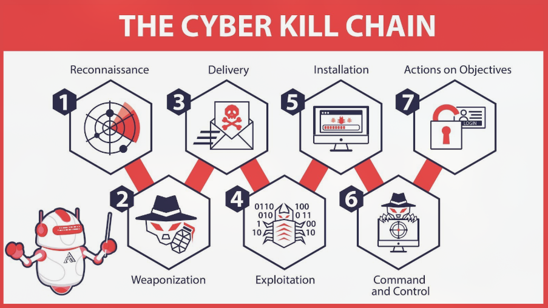
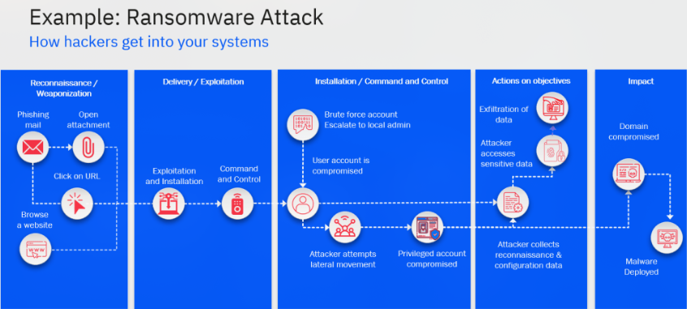

# Cyber Kill Chain

**Type:** 📘 Concept Documentation

## What is the Cyber Kill Chain?

The Cyber Kill Chain is a cybersecurity framework developed by **Lockheed Martin** that describes the stages of a cyberattack from the attacker's perspective.

It helps defenders understand how attackers operate so they can detect and disrupt attacks before they achieve their objectives.

---

## Why is it important?

The Cyber Kill Chain enables SOC analysts to:

- Understand the progression of an attack.
- Identify where an attacker is in the intrusion lifecycle.
- Detect malicious activity earlier.
- Apply appropriate defensive measures.
- Improve incident response and threat hunting.

---

# The Seven Stages

## 1. Reconnaissance

The attacker gathers information about the target.

Examples:

- OSINT
- DNS enumeration
- WHOIS lookups
- Employee information
- Email harvesting
- Network scanning

**Defender Actions**

- Monitor reconnaissance attempts.
- Protect public information.
- Detect scanning activity.

---

## 2. Weaponization

The attacker prepares a malicious payload.

Examples:

- Creating malware
- Embedding exploits into documents
- Building phishing attachments
- Preparing ransomware payloads

This stage occurs outside the victim's environment.

---

## 3. Delivery

The payload is delivered to the victim.

Common delivery methods:

- Phishing emails
- Malicious websites
- USB devices
- Drive-by downloads
- Remote services

**Defender Actions**

- Email filtering
- Web filtering
- User awareness training
- Attachment sandboxing

---

## 4. Exploitation

The attacker exploits a vulnerability to execute malicious code.

Examples:

- Office macro execution
- Browser exploits
- Software vulnerabilities
- Credential abuse

**Defender Actions**

- Patch management
- Vulnerability scanning
- Endpoint protection
- Exploit prevention

---

## 5. Installation

The attacker establishes persistence.

Examples:

- Installing malware
- Scheduled Tasks
- Registry Run Keys
- Services
- Startup folders

**Defender Actions**

- EDR monitoring
- Persistence detection
- Registry monitoring
- File integrity monitoring

---

## 6. Command and Control (C2)

The compromised system communicates with the attacker's infrastructure.

Examples:

- HTTPS beaconing
- DNS tunneling
- Reverse shells
- TOR connections

**Defender Actions**

- DNS monitoring
- Proxy monitoring
- Firewall rules
- Network IDS/IPS

---

## 7. Actions on Objectives

The attacker performs the final objective.

Examples:

- Data exfiltration
- Credential theft
- Lateral movement
- Privilege escalation
- Ransomware deployment
- System destruction

At this stage, the organization is actively compromised.

---

# Kill Chain Summary

| Stage                 | Attacker Goal          |
|-----------------------|------------------------|
| Reconnaissance        | Gather information     |
| Weaponization         | Prepare the attack     |
| Delivery              | Send the payload       |
| Exploitation          | Execute malicious code |
| Installation          | Gain persistence       |
| Command & Control     | Maintain remote access |
| Actions on Objectives | Achieve the mission    |

---

# Example Attack

Imagine a ransomware attack:

1. The attacker collects employee email addresses.
2. Creates a malicious Word document.
3. Sends a phishing email.
4. The victim opens the attachment.
5. Malware installs itself and creates persistence.
6. The infected host connects to a C2 server.
7. The attacker encrypts company files and demands payment.

Every step follows the Cyber Kill Chain.

---

# SOC Perspective

SOC analysts use the Kill Chain to determine:

- Which phase the attacker has reached.
- What evidence should exist.
- What defensive actions should be taken.
- Whether the attack can still be contained.

Earlier detection greatly reduces the impact of an attack.

---

# Advantages

- Easy to understand
- Helps visualize attack progression
- Supports incident response
- Improves defensive planning
- Useful for threat hunting

---

# Limitations

- Focuses mainly on traditional network intrusions.
- Does not fully represent modern cloud-based attacks.
- Less detailed than MITRE ATT&CK.
- Modern attackers may skip or repeat stages.

---

# Key Takeaways

- Every cyberattack follows a sequence of activities.
- Defenders should aim to detect attacks as early as possible.
- Stopping an attacker in the early stages greatly reduces business impact.
- The Cyber Kill Chain provides a structured way to understand attacker behavior.

---

# What I Learned

- The Cyber Kill Chain breaks an attack into seven distinct stages.
- Each stage presents opportunities for defenders to detect or stop an intrusion.
- SOC analysts use the Kill Chain to understand attacker progression and prioritize response efforts.
- Combining the Cyber Kill Chain with MITRE ATT&CK provides a more complete understanding of cyber threats.
