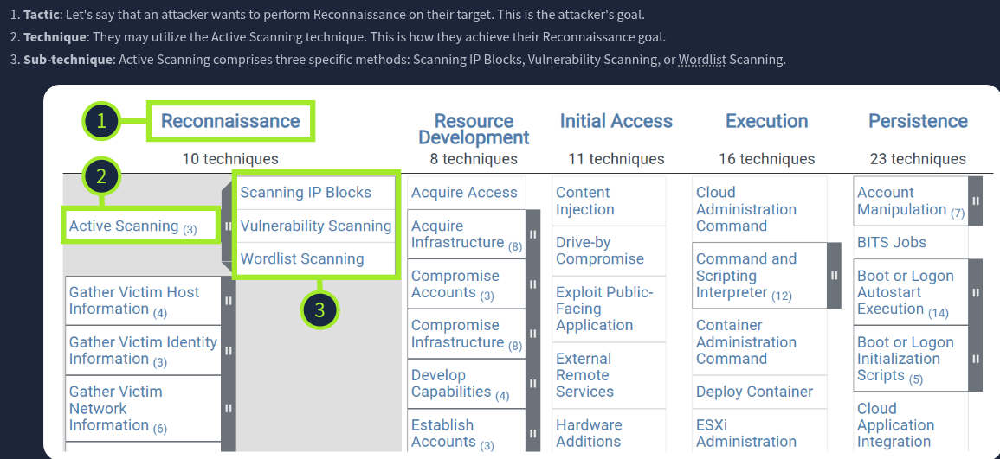
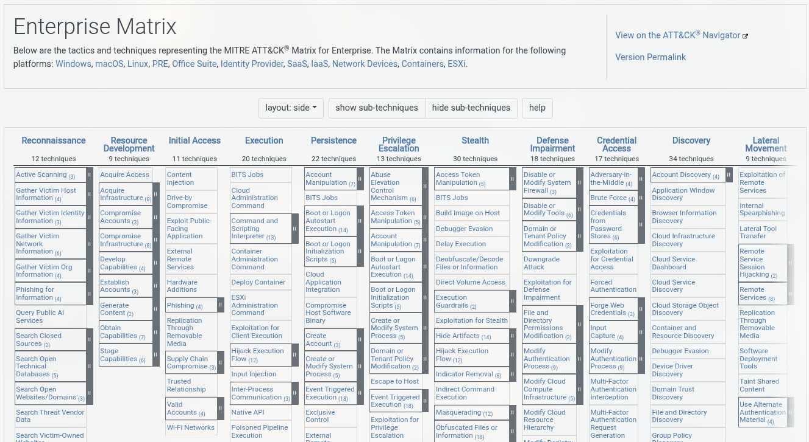
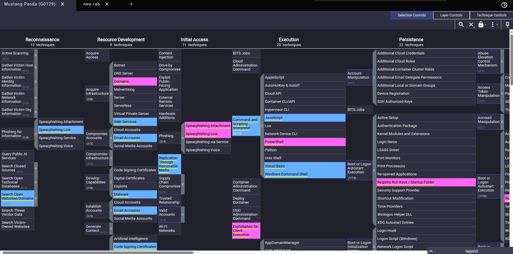

# MITRE ATT&CK Framework

 **Type:** 📘 Concept Documentation

## What is MITRE ATT&CK?

MITRE ATT&CK (Adversarial Tactics, Techniques, and Common Knowledge) is a globally recognized knowledge base that documents how real-world adversaries behave during cyberattacks.

Instead of focusing on malware or vulnerabilities, MITRE ATT&CK focuses on **attacker behavior**. It categorizes the tactics, techniques, and procedures (TTPs) used by threat actors throughout an intrusion.

The framework is continuously updated using observations from real-world attacks.

---

# Why is MITRE ATT&CK important?

MITRE ATT&CK provides a common language for security teams.

SOC analysts use it to:

- Investigate incidents
- Map attacker behavior
- Prioritize detections
- Build detection rules
- Perform threat hunting
- Improve incident response
- Measure security coverage

It has become one of the most widely adopted cybersecurity frameworks.

---

# Core Concepts

## Tactics

Tactics describe **the attacker's objective**.

Examples:

- Initial Access
- Execution
- Persistence
- Privilege Escalation
- Defense Evasion
- Credential Access
- Discovery
- Lateral Movement
- Collection
- Exfiltration
- Command and Control
- Impact

Think of tactics as **"What is the attacker trying to accomplish?"**

---

## Techniques

Techniques describe **how attackers achieve a tactic**.

Example:

**Execution**

Technique:

```
T1059
Command and Scripting Interpreter
```

---

## Sub-Techniques

Some techniques contain more specific behaviors.

Example:

```
T1059.001

PowerShell
```

PowerShell is one specific way of executing commands.



---

# ATT&CK Matrix

The ATT&CK Matrix organizes attacker behavior by tactics and techniques.

Example:

| Tactic            | Example Technique            |
|-------------------|------------------------------|
| Initial Access    | Phishing                     |
| Execution         | PowerShell                   |
| Persistence       | Scheduled Task               |
| Credential Access | LSASS Memory Dump            |
| Discovery         | System Information Discovery |
| Lateral Movement  | Remote Services              |
| Impact            | Data Encryption for Impact   |



The matrix allows analysts to quickly map observed activity.

---

# ATT&CK IDs

Every technique has a unique identifier.

Examples:

| ID        | Technique                         |
|-----------|-----------------------------------|                               
| T1059     | Command and Scripting Interpreter |
| T1059.001 | PowerShell                        |
| T1566     | Phishing                          |
| T1003     | OS Credential Dumping             |
| T1021     | Remote Services                   |
| T1486     | Data Encrypted for Impact         |

These identifiers provide a standardized way to describe attacker behavior.

---

# Example Investigation

Imagine an attacker sends a phishing email.

The victim opens the attachment.

PowerShell executes a malicious script.

The attacker steals credentials.

The compromised host communicates with a Command and Control server.

Possible ATT&CK mapping:

| Activity           | Technique |
|--------------------|-----------|
| Phishing Email     | T1566     |
| PowerShell         | T1059.001 |
| Credential Dumping | T1003     |
| Remote Services    | T1021     |
| C2 Communication   | TA0011    |

This mapping helps analysts understand the attack.

---

# ATT&CK Navigator

MITRE provides the ATT&CK Navigator, a web-based tool used to visualize techniques within the ATT&CK Matrix.

SOC analysts use it to:

- Highlight detections
- Measure defensive coverage
- Track adversary techniques
- Plan threat hunting activities



---

# ATT&CK in a SOC

During an investigation, analysts often:

1. Receive an alert.
2. Identify attacker behavior.
3. Map observed activity to ATT&CK techniques.
4. Search for related techniques.
5. Determine the attack stage.
6. Improve future detections.

---

# Example

EDR Alert:

```
powershell.exe downloaded a remote script
```

Possible ATT&CK mapping:

```
Execution

↓

T1059.001
PowerShell
```

---

# MITRE ATT&CK and Cyber Kill Chain

| MITRE ATT&CK                | Cyber Kill Chain             |
|-----------------------------|------------------------------|
| Describes attacker behavior | Describes attack progression |
| Hundreds of techniques      | Seven attack stages          |
| Operational framework       | Strategic framework          |
| Highly detailed             | High-level overview          |

The two frameworks complement each other and are often used together during investigations.

---

# Advantages

- Industry standard
- Based on real-world attacks
- Continuously updated
- Common language for security teams
- Supports threat hunting
- Improves detection engineering
- Useful during incident response

---

# Limitations

- Does not assign risk scores.
- Requires analyst interpretation.
- Not every attack follows the same techniques.
- Large framework with a learning curve.

---

# Key Takeaways

- MITRE ATT&CK focuses on attacker behavior rather than malware.
- Tactics describe attacker goals.
- Techniques explain how attackers achieve those goals.
- ATT&CK IDs provide a standardized reference for techniques.
- Mapping incidents to ATT&CK improves investigations and detection capabilities.

---

# What I Learned

- MITRE ATT&CK provides a standardized framework for understanding adversary behavior.
- Mapping alerts to ATT&CK techniques improves investigation quality and communication.
- Behavior-based detections are more effective than relying solely on Indicators of Compromise (IOCs).
- ATT&CK is widely used in SOC operations, threat hunting, detection engineering, and incident response.
