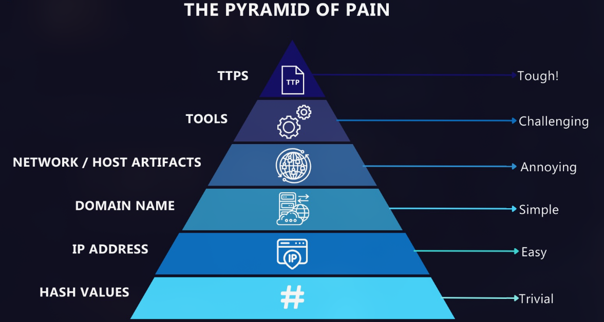
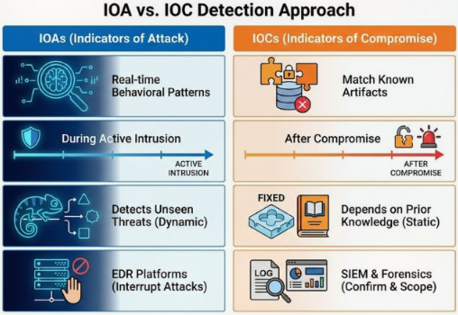
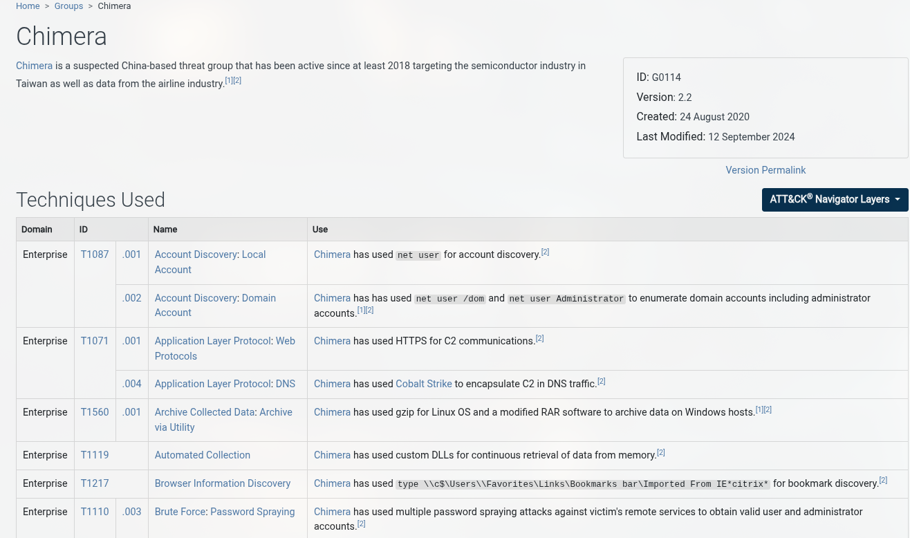

# Pyramid of Pain

**Type:** 📘 Concept Documentation

## What is the Pyramid of Pain?

The Pyramid of Pain is a cybersecurity framework created by **David J. Bianco**. It ranks Indicators of Compromise (IOCs) based on how difficult they are for an attacker to change once they have been detected.

The higher an indicator appears on the pyramid, the more disruptive it is for an attacker when defenders detect and block it.



---

## Why is it important?

The Pyramid of Pain helps SOC analysts prioritize detections that have the greatest impact on adversaries.

Instead of only blocking easily replaceable indicators such as IP addresses or file hashes, defenders should aim to detect attacker behaviors and techniques that are much harder to modify.

---

## Pyramid Levels

### 1. Hash Values

Examples:

- MD5
- SHA-1
- SHA-256

**Difficulty for attacker:** Very Low

Attackers can easily generate a new file with a different hash by recompiling or making small modifications.

Example:

```
SHA256:
44d88612fea8a8f36de82e1278abb02f
```

---

### 2. IP Addresses

Examples:

- Command & Control servers
- Malware download servers

**Difficulty for attacker:** Low

Attackers can quickly move their infrastructure to a different IP address or cloud provider.

Example:

```
185.199.110.153
```

---

### 3. Domain Names

Examples:

- malicious-example.com
- update-check.net

**Difficulty for attacker:** Moderate

Registering new domains requires more effort and may impact attacker infrastructure.

---

### 4. Network Artifacts

These include observable characteristics of network traffic.

Examples:

- HTTP User-Agent
- URI patterns
- DNS requests
- TLS fingerprints

**Difficulty for attacker:** Moderate to High

Changing network behavior often requires modifying malware or infrastructure.

---

### 5. Host Artifacts

Observable evidence left on an endpoint.

Examples:

- Registry keys
- Scheduled Tasks
- Mutexes
- File paths
- Process names

**Difficulty for attacker:** High

Changing these artifacts often requires modifying malware functionality.

---

### 6. Tools

The software attackers use.

Examples:

- Mimikatz
- PsExec
- Cobalt Strike
- BloodHound

**Difficulty for attacker:** Very High

Replacing or rewriting tooling requires significant effort and may reduce attacker effectiveness.

---

### 7. TTPs (Tactics, Techniques, and Procedures)

The highest level of the pyramid.

TTPs describe **how** attackers operate rather than **what** they use.

Examples:

- Credential dumping
- PowerShell execution
- Pass-the-Hash
- Lateral movement
- Persistence through scheduled tasks

These behaviors are commonly mapped to the **MITRE ATT&CK** framework.

**Difficulty for attacker:** Extremely High

Changing an attacker's tradecraft often requires redesigning the entire operation.

---

## Pyramid Summary

| Level  | Difficulty for Attacker |
|------------------|---------------|
| TTPs             | ⭐⭐⭐⭐⭐High|
| Tools            | ⭐⭐⭐⭐      |
| Host Artifacts   | ⭐⭐⭐        |
| Network Artifacts| ⭐⭐⭐        |
| Domain Names     | ⭐⭐          |
| IP Addresses     | ⭐            |
| Hash Values      | ⭐Low         |

---

## SOC Perspective

A mature SOC aims to detect behaviors rather than individual indicators.

For example:

Instead of detecting a single malicious hash, analysts should detect:

- Credential dumping
- Suspicious PowerShell execution
- Privilege escalation
- Lateral movement
- Command and Control communication

Behavioral detections remain effective even when attackers change malware, IP addresses, or domains.

---

## Example

### Weak Detection

```
Alert if SHA256 = abc123...
```

The attacker simply recompiles the malware.

Detection is bypassed.

---

### Strong Detection

```
Alert when powershell.exe downloads and executes a remote script,
creates a scheduled task, and connects to an external IP.
```

Changing this behavior is significantly more difficult for the attacker.



---

## Relation to MITRE ATT&CK

The Pyramid of Pain complements the MITRE ATT&CK framework.

While MITRE describes **attacker tactics and techniques**, the Pyramid of Pain explains **which detections are most disruptive** to those attackers.

Together, they help SOC analysts build more effective detection strategies.



---

## Key Takeaways

- Not all indicators provide the same defensive value.
- Hashes and IP addresses are easy for attackers to replace.
- Behavioral detections are significantly more effective.
- Mature SOCs prioritize detections based on TTPs.
- The Pyramid of Pain encourages defenders to increase the operational cost for attackers.

---

## What I Learned

- The value of a detection depends on how difficult it is for an attacker to evade.
- TTP-based detections provide the greatest long-term defensive benefit.
- Effective SOC teams focus on behavioral analysis instead of relying solely on IOCs.
- The Pyramid of Pain complements frameworks such as MITRE ATT&CK by helping prioritize detection engineering.
