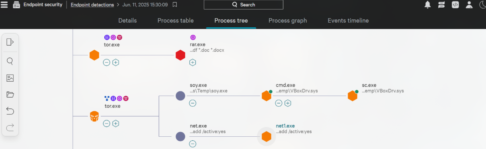
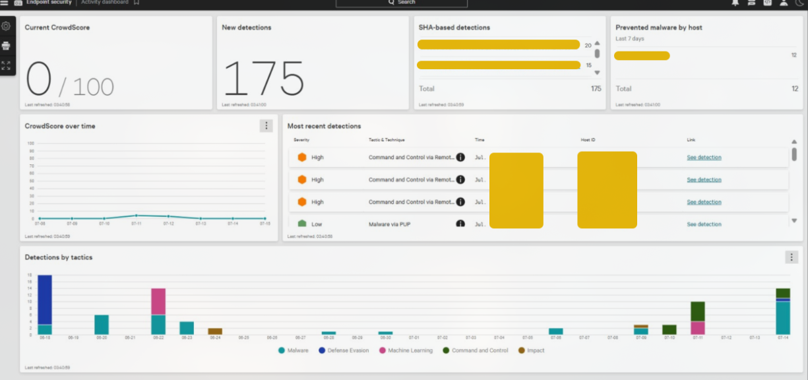

# Introduction to EDR

**Type:** 📘 Concept Documentation

## What is an EDR?

Endpoint Detection and Response (EDR) continuously monitors endpoints to detect, investigate, and respond to malicious activity.

## Popular EDR solutions

-CrowdStrike Falcon
-SentinelOne ActiveEDR
-Microsoft Defender for Endpoint
-OpenEDR
-Symantec EDR

 ## Common telemetry | Features

- **Process creation**
  - Shows every process started on the endpoint.

- **Process tree**
  - Reveals parent-child relationships used during investigations.

  

- **Command line**
  - Displays arguments passed to executables, often revealing attacker intent.

- **Network connections**
  - Identifies external communications and potential C2 traffic.

- **Registry changes**
  - Helps detect persistence mechanisms.

- **File modifications**
  - Shows created, modified, or deleted files.

## Difference between AV and EDR

|     Antivirus     |              EDR                |
|-------------------|---------------------------------|
| Signature-based   | Behavioral detection            |
| Blocks malware    | Detects, investigates, responds |
| Limited telemetry | Rich endpoint telemetry         |

The dashboard provides a high-level overview of the endpoint security posture.

### Key sections

- **CrowdScore**
  - Overall security risk score.
  - Helps analysts quickly assess the organization's current security state.

- **New Detections**
  - Number of alerts generated within the selected time period.
  - Indicates current alert volume.

- **SHA-based Detections**
  - Malware detections based on file hashes.
  - Useful for identifying known malicious files.

- **Prevented Malware by Host**
  - Shows which endpoints have blocked malware.
  - Helps identify systems requiring further investigation.

- **Most Recent Detections**
  - Displays the latest alerts.
  - Includes severity, MITRE tactic, timestamp, affected host, and a link to investigate.

- **Detections by Tactic**
  - Groups alerts according to attacker tactics (e.g., Command & Control, Malware, Defense Evasion).
  - Helps analysts understand attack trends.

## SOC workflow

Alert → Investigate → Contain → Eradicate → Recover

## What I learned

- EDRs focus on behavior rather than signatures.
- Process lineage is one of the strongest pieces of evidence during investigations.
- Endpoint telemetry enables analysts to reconstruct attacker activity.
- EDRs provide visibility even when malware is not immediately blocked.
