# Wireshark: Packet Operations

**Type:** 🛠️ Tool Walkthrough

## Objective

Practice Wireshark's statistics tools and advanced display filters against a large capture (`Exercise.pcapng`, ~112 MB / 81,530 packets) to answer targeted analysis questions — building the "find the needle in the haystack" skills needed for real investigations.

---

## Tools Used

* **Wireshark 4.4.9** — Statistics menu (Resolved Addresses, Conversations, Endpoints, Service Response Time, HTTP Load Distribution, Expert Information) and display filters

---

## Part 1 — Statistics-Based Analysis

Before filtering packet-by-packet, Wireshark's **Statistics** menu gives a high-level summary of a capture — useful for orienting on a large file before drilling in.

### Resolved Addresses

`Statistics → Resolved Addresses` — searched "bbc" to resolve a hostname to its IP.

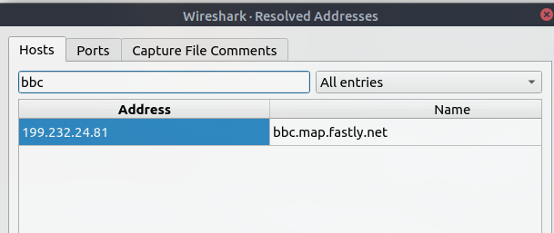

**Q: IP address of the hostname starting with "bbc"?** → `199.232.24.81` (`bbc.map.fastly.net`)

### Conversations

`Statistics → Conversations` — the IPv4 tab shows every unique source/destination pair and how much data passed between them.

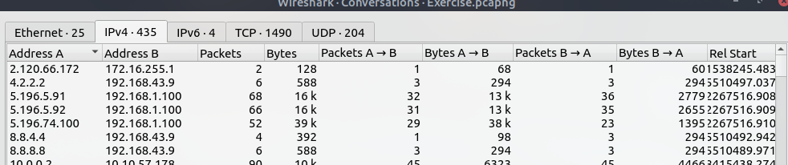

**Q: Number of IPv4 conversations?** → `435`

### Endpoints

`Statistics → Endpoints` lists every unique address seen in the capture, per layer (Ethernet, IPv4, IPv6, TCP, UDP), with traffic volume and — for IP — geolocation and AS organization columns.

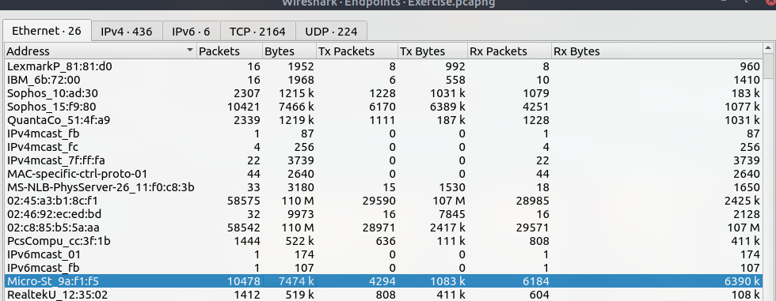

**Q: Bytes (k) transferred from the "Micro-St" MAC address?** → `7474` (7,474 k bytes)

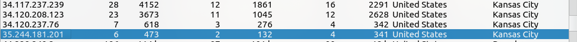

**Q: Number of IP addresses linked with "Kansas City"?** → `4`

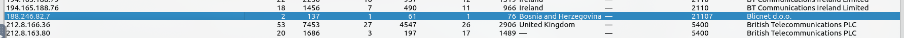

**Q: Which IP address is linked with the "Blicnet" AS Organization?** → `188.246.82.7`

The geolocation and AS org columns are especially useful for quickly spotting traffic to unexpected countries or hosting providers during triage.

### Destinations and Ports

Under `Statistics → Destinations and Ports`, traffic is broken down hierarchically by destination IP, then protocol, then port — sorted by count.

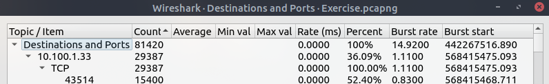

**Q: Most used IPv4 destination address?** → `10.100.1.33` (29,387 packets, 36.09% of all destination/port traffic)

### Service Response Time — DNS

`Statistics → Service Response Time → DNS` measures how long each DNS server took to respond.

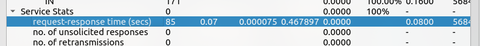

**Q: Max service request-response time of the DNS packets?** → `0.467897` seconds

A max response time this high, buried among much faster responses, can flag an overloaded or suspicious DNS server worth a closer look.

### HTTP Load Distribution

`Statistics → HTTP → Load Distribution` breaks down HTTP requests by host, then by the IP that served them.

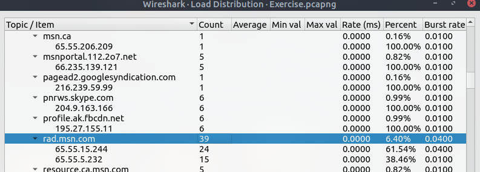

**Q: Number of HTTP requests to `rad.msn.com`?** → `39`

---

## Part 2 — Display Filter Analysis

The rest of the questions were answered by applying a display filter and reading the **Displayed** packet count from the status bar.

| Question | Filter Used | Answer |
| --- | --- | --- |
| Number of IP packets | `ip` | `81420` |
| Packets with TTL < 10 | `ip.ttl < 10` | `66` |
| Packets using TCP port 4444 | `tcp.port == 4444` | `632` |
| HTTP GET requests sent to port 80 | `http.request.method == GET && tcp.port == 80` | `527` |
| Type A DNS query responses | `dns.qry.type == 1 && dns.flags.response == 1` | `51` |
| IIS servers, packets not from port 80 | `upper(http.server) contains "IIS" && tcp.srcport != 80` | `21` |
| IIS version 7.5 packets | `http contains "IIS/7.5"` | `71` |
| Packets using ports 3333, 4444, or 9999 | `tcp.port in {3333 4444 9999}` | `2235` |
| Packets with even TTL numbers | `string(ip.ttl) matches "[02468]$"` | `77289` |

### Selected Filters

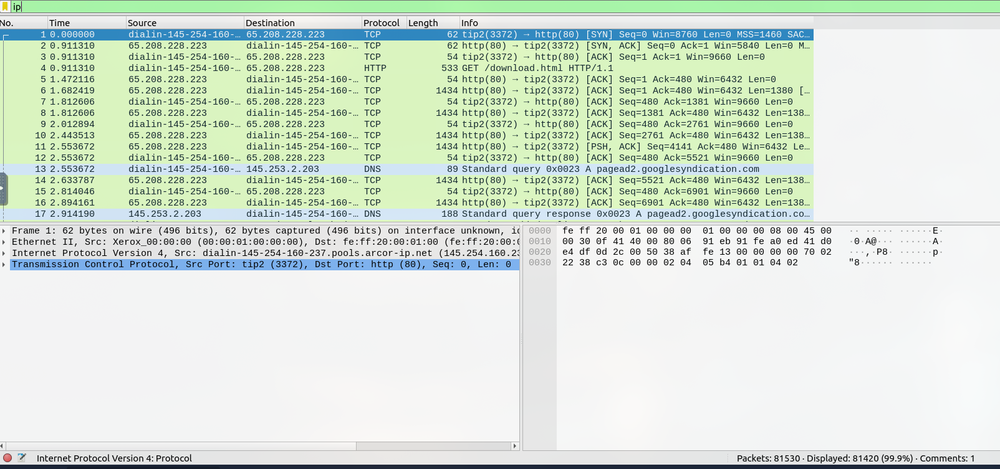
*`ip` — isolates all IP traffic, dropping any non-IP frames from the count.*

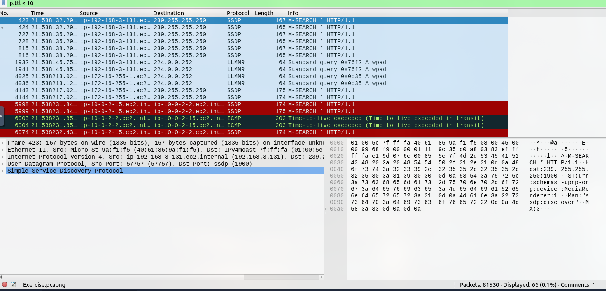
*`ip.ttl < 10` — a low TTL can indicate traceroute activity or traffic that has crossed many hops; here it surfaced SSDP/LLMNR broadcast noise and ICMP Time-to-Live-exceeded responses.*

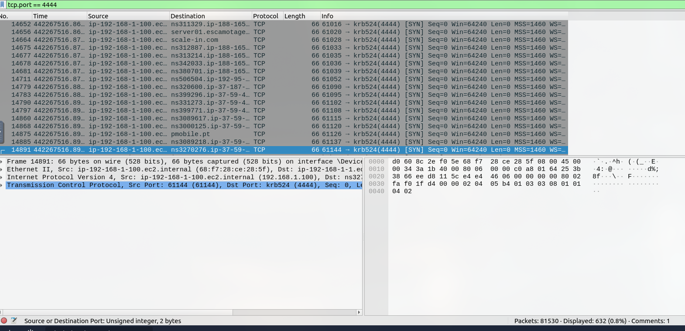
*`tcp.port == 4444` — port 4444 is a well-known default for Metasploit payload handlers, making unexplained traffic on this port worth investigating.*

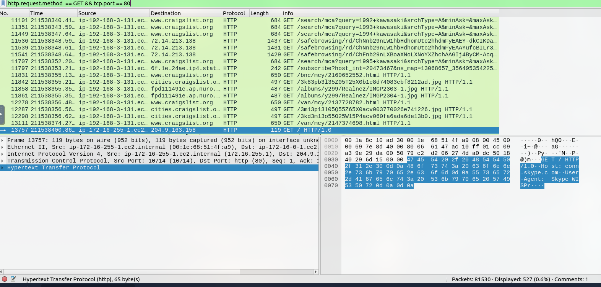
*Combines an HTTP method filter with a port filter to isolate plaintext web requests.*

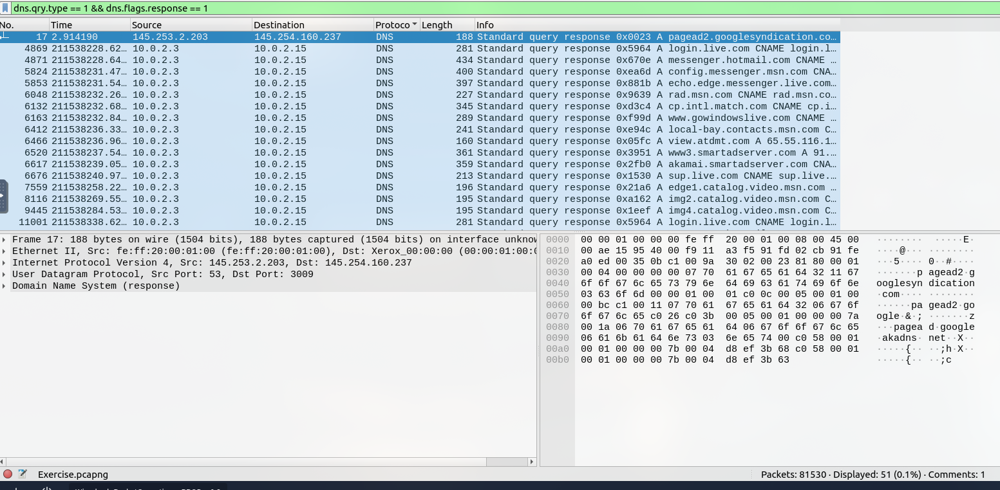
*Filters DNS **responses** to A-record queries specifically, filtering out other record types (CNAME, AAAA, etc.) and the original queries.*

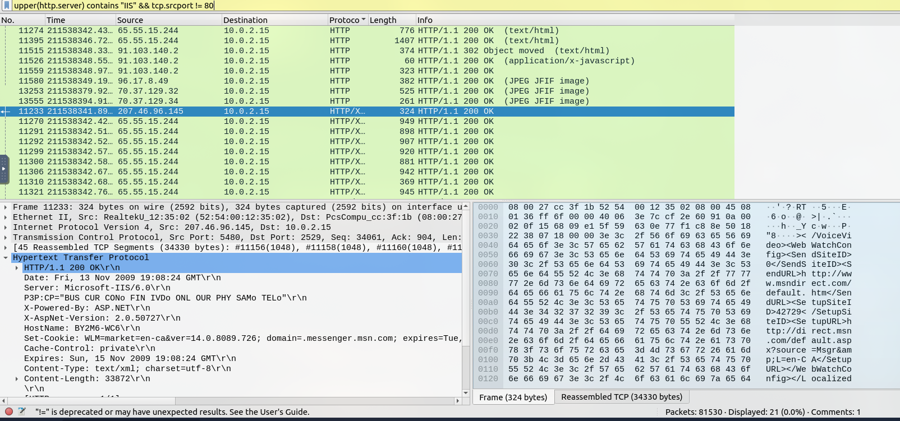
*`upper(http.server) contains "IIS"` normalizes case before matching — useful since server banners aren't guaranteed to be consistently capitalized.*

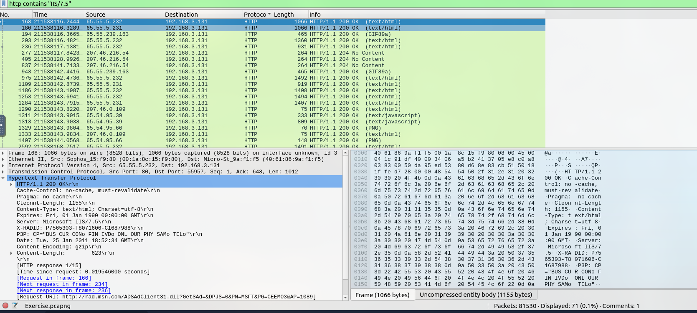
*Pinpoints a specific server version banner — useful for scoping which internal/external hosts are running a potentially vulnerable IIS version.*

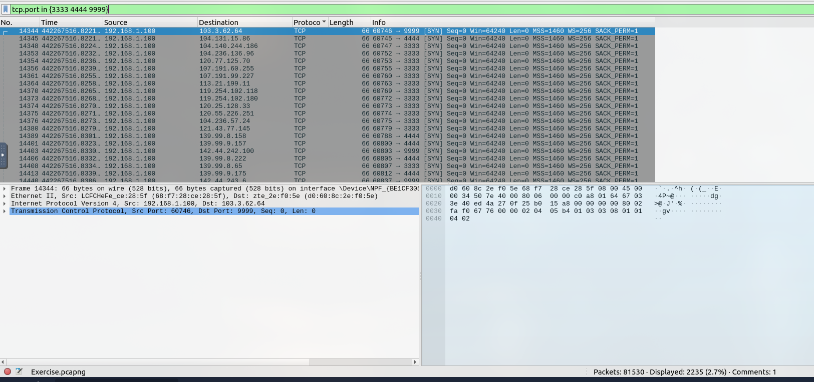
*`tcp.port in {...}` checks several ports at once — cleaner than chaining multiple `||` conditions, and commonly used to hunt for known malware C2 ports in one pass.*

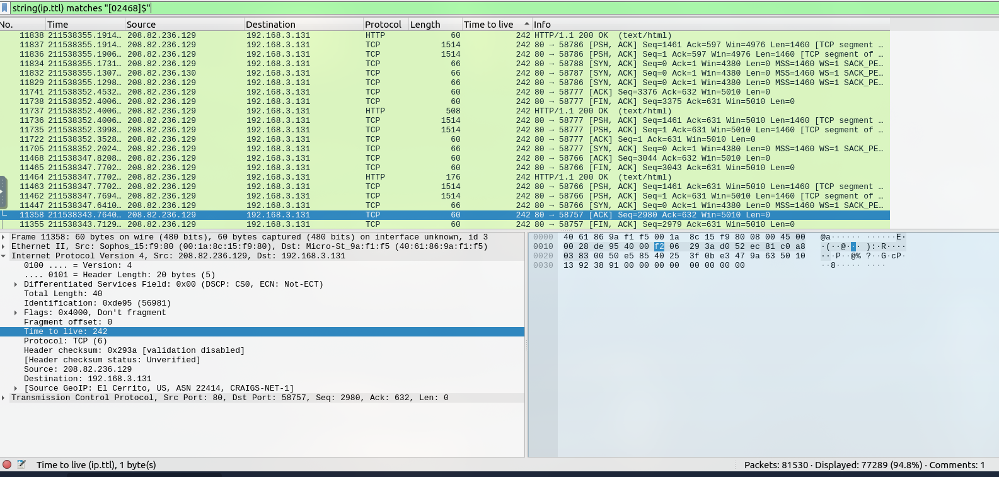
*`string(ip.ttl) matches "[02468]$"` converts the TTL to a string and regex-matches the last digit — a good example of Wireshark's filter language handling logic beyond simple comparisons.*

---

## Part 3 — Expert Information

`Analyze → Expert Information` (viewed here under the **Checksum Control** profile) surfaces protocol anomalies Wireshark flags automatically — malformed packets, checksum errors, retransmissions, and more.

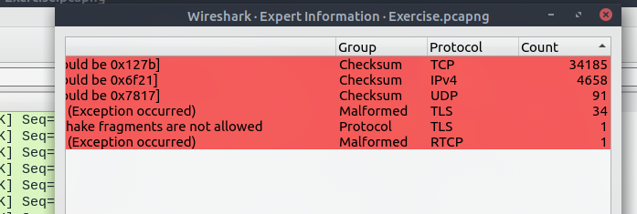

**Q: Number of "Bad TCP Checksum" packets?** → `34185`

A large volume of bad checksums is often benign — commonly caused by **checksum offloading**, where the NIC calculates the checksum after Wireshark captures the packet — but it's worth confirming rather than assuming, since it can also indicate a misconfigured device or tampered traffic.

---

## Additional Question

**Q: Using the existing filtering button, what is the number of displayed packets?**
→ `261`

This used one of Wireshark's pre-built filter buttons (added to the toolbar via **Analyze → Display Filters**) rather than typing a filter manually — a reminder that frequently-used filters can be saved as one-click buttons for faster triage.

---

## Key Takeaways

* The **Statistics menu** (Conversations, Endpoints, Resolved Addresses, Service Response Time, HTTP Load Distribution) is the fastest way to orient inside a large, unfamiliar capture before writing a single filter.
* **Endpoints geolocation/AS columns** quickly surface traffic to unexpected countries or hosting providers.
* Advanced display filters — combining fields (`&&`), sets (`in {}`), string conversion (`string()`), and case normalization (`upper()`) — go well beyond simple `ip.addr ==` matching and are essential for precise triage.
* **Expert Information** flags protocol-level anomalies automatically, but findings like checksum errors need context (e.g., checksum offloading) before being treated as suspicious.
* Ports like `4444`, `3333`, and `9999` are common default handler ports for offensive tooling (e.g., Metasploit) and are worth flagging as a matter of habit, even without a prior alert pointing to them.
