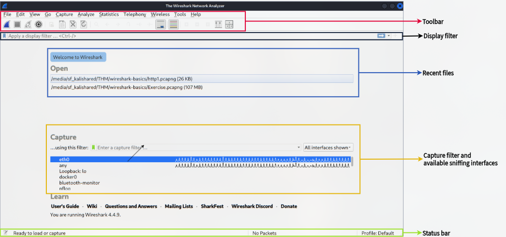
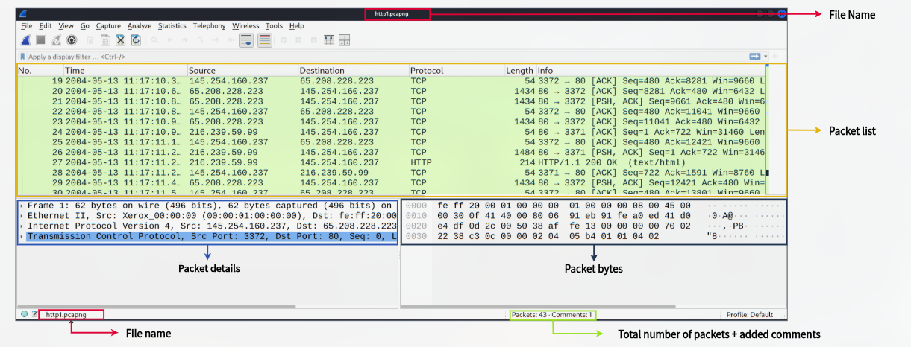
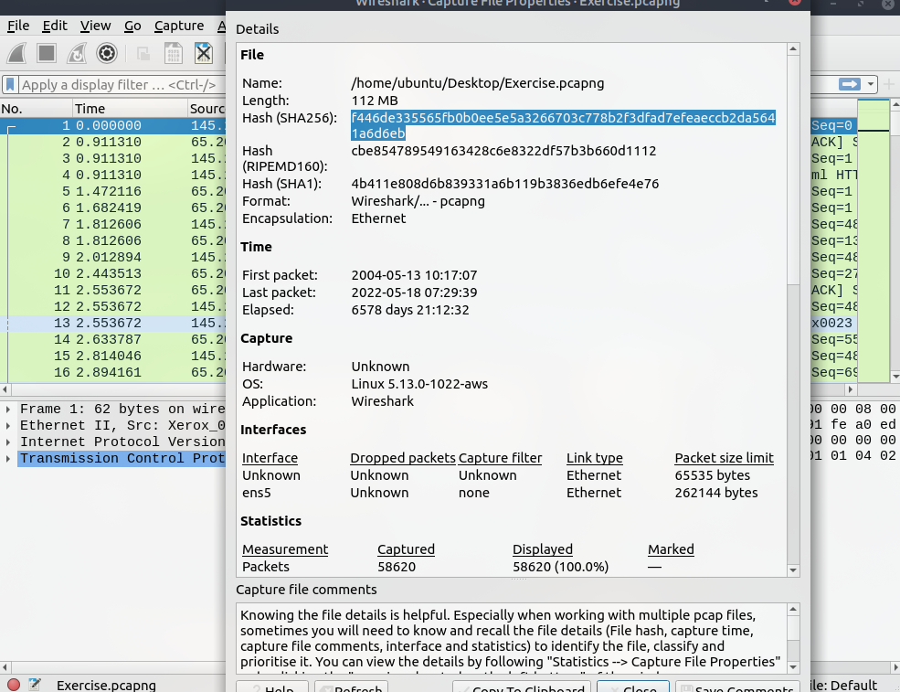

# Wireshark: The Basics

**Type:** 🛠️ Tool Walkthrough

## Objective

Get familiar with the Wireshark interface — its layout, core panes, and file properties view — as the foundation for the packet analysis and traffic analysis write-ups that follow.

---

## Tools Used

* **Wireshark 4.4.9** — packet capture and protocol analysis

---

## Main Interface Overview

On launch, Wireshark's main window is split into a few key regions.

| Region | Purpose |
| --- | --- |
| Toolbar | Quick access to capture/stop/restart, save, find, and view options |
| Display filter bar | Filters packets already captured/loaded (e.g. `http`, `ip.addr == x.x.x.x`) |
| Recent files | Shortcuts to recently opened `.pcap` / `.pcapng` files |
| Capture section | Lists available sniffing interfaces (`eth0`, `any`, `Loopback: lo`, etc.) with live traffic sparklines, plus a capture filter field to limit what's captured *before* it hits disk |
| Status bar | Current state (e.g. "Ready to load or capture"), packet count, and active profile |

**Key distinction:** a **capture filter** (Capture section) limits what gets recorded in the first place, while a **display filter** (top bar) only hides/shows packets from data already captured — this matters when deciding whether to filter noise out at capture time vs. keep everything for later analysis.

---

## Packet List, Details, and Bytes Panes

Once a capture file is opened (`http1.pcapng`), the window splits into three panes stacked vertically.

| Pane | Contents |
| --- | --- |
| Packet list | One row per packet — No., Time, Source, Destination, Protocol, Length, Info |
| Packet details | Expandable breakdown of the selected packet by layer (Frame → Ethernet II → IPv4 → TCP → \[higher-layer protocol]) |
| Packet bytes | Raw hex and ASCII representation of the selected packet, synced with whatever layer is highlighted in the details pane |

The status bar at the bottom also tracks the **total packet count and any comments** added to the file — useful for flagging packets of interest during an investigation without altering the capture itself.

In this capture (`http1.pcapng`), the packet list shows a TCP three-way handshake followed by an HTTP request/response between `145.254.160.237` and `65.208.228.223`, visible as an `HTTP/1.1 200 OK` response in the Info column.

---

## Capture File Properties

Under **Statistics → Capture File Properties**, Wireshark exposes metadata about the file itself — separate from the packets it contains.

### Key Fields

| Field | Value (Exercise.pcapng) |
| --- | --- |
| Length | 112 MB |
| SHA256 Hash | `f446de335565fb0b0ee5e5a3266703c778b2f3dfad7efeaeccb2da5641a6d6eb` |
| Encapsulation | Ethernet |
| First packet | 2004-05-13 10:17:07 |
| Last packet | 2022-05-18 07:29:39 |
| OS / Application | Linux 5.13.0-1022-aws / Wireshark |
| Captured packets | 58,620 |
| Displayed packets | 58,620 (100%) |

### Why this matters

* **File hashes (SHA256/SHA1/RIPEMD160)** let an analyst verify a capture hasn't been tampered with and uniquely identify it when working across multiple PCAPs — important for chain-of-custody during an investigation.
* **First/last packet timestamps** immediately show the time span covered — a multi-year elapsed time (as seen here) is a strong hint the file merges traffic from several unrelated captures rather than one continuous session.
* **Capture file comments** provide a place to record context (source, purpose, findings) directly inside the file so it travels with the evidence.

---

## Key Takeaways

* Wireshark's interface separates **capture-time filtering** (Capture section) from **post-capture filtering** (display filter bar).
* The packet list/details/bytes panes stay synchronized — selecting a layer in the details pane highlights the corresponding bytes.
* **Statistics → Capture File Properties** is the first place to check when opening an unfamiliar PCAP: file hash, time range, and packet counts orient the analyst before diving into individual packets.
* This walkthrough covers orientation only — filtering, following streams, and anomaly detection are covered in the follow-up Wireshark write-ups.
