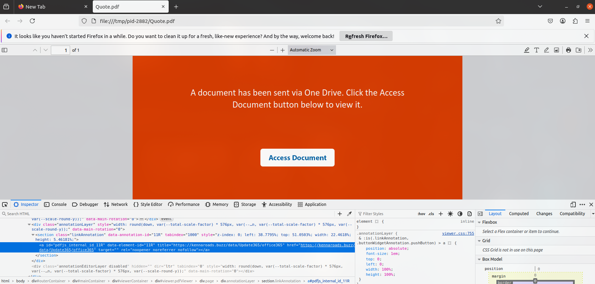
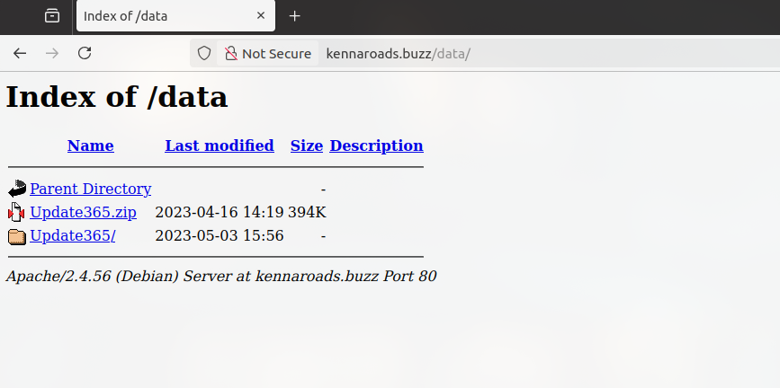
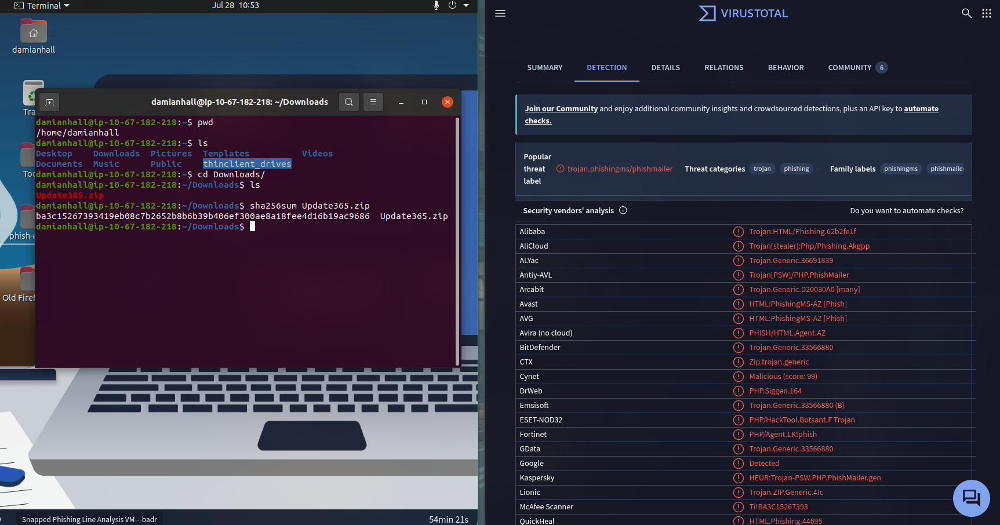
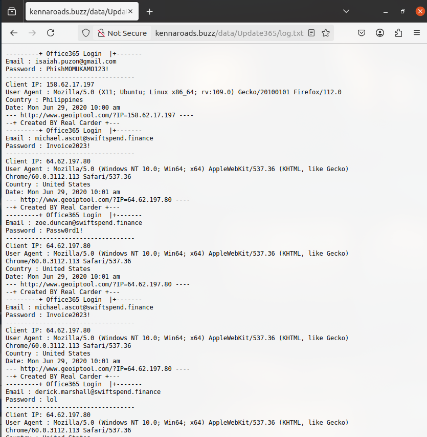
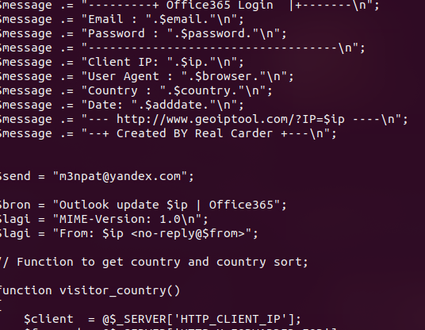

# Phishing Line Analysis - Write-up

## Overview

A targeted phishing campaign affected multiple employees at **SwiftSpend Financial**, resulting in credential harvesting and unauthorized account lockouts. This investigation analyzes phishing email artifacts, embedded links, exposed server directories, the adversary's phishing kit, and key Indicators of Compromise (IOCs) to determine the full scope of the attack.

### What was investigated

- Phishing email samples
- Redirect links embedded inside a malicious PDF attachment
- Open directories exposed on the phishing server
- Credential log files
- PHP source code of the phishing kit

### Main Objective

Determine the scope of the attack, recover compromised credentials, identify the adversary's exfiltration mechanisms, and map technical findings to threat intelligence frameworks.

### Key Learnings

- Identified how phishing campaigns use PDF attachments to bypass email security.
- Investigated exposed directory listings that leaked phishing infrastructure.
- Performed static analysis of a phishing kit to identify attacker infrastructure.
- Extracted Indicators of Compromise (IOCs) for detection and response.

---

## Skills Practiced

- Email Header & Artifact Analysis
- Malicious Document Analysis
- Phishing Kit Triage
- Static PHP Source Code Analysis
- Threat Intelligence Correlation
- VirusTotal Analysis
- Incident Response
- IOC Extraction

---

## Scenario

As a member of the IT department at **SwiftSpend Financial**, multiple employees reported receiving a suspicious invoice email. Several users entered their credentials into a fake Microsoft login page and subsequently lost access to their accounts.

The objective was to investigate the phishing campaign, identify compromised users, analyze the phishing infrastructure, recover attacker artifacts, and recommend mitigation strategies.

---

## Objectives

- Analyze phishing email artifacts.
- Investigate embedded phishing links.
- Examine the exposed phishing kit.
- Analyze the payload using VirusTotal.
- Recover compromised credentials.
- Identify attacker infrastructure.
- Produce actionable detection and mitigation recommendations.

---

# Tools Used

| Tool | Purpose |
|------|---------|
| Linux Terminal (sha256sum) | Compute SHA256 hashes |
| Mozilla Firefox | Analyze phishing pages |
| Firefox Developer Tools | Inspect embedded links |
| VirusTotal | Threat intelligence & malware analysis |
| Text Editor / Grep | Analyze PHP source code |

---

# Investigation

## Step 1 – Phishing Email Analysis

The investigation began by inspecting the phishing email stored in the **phish-emails** directory.

The email impersonated an invoice notification and contained a malicious PDF attachment.

Inspection revealed:

- Sender: **Accounts.Payable@groupmarketingonline.icu**
- Recipient: **William McClean**
- Attachment: **Quote.pdf**

Opening the attachment displayed a fake Microsoft OneDrive page requesting the user to access the document.

Using Firefox Developer Tools, the embedded hyperlink was extracted.

### Evidence

| Indicator | Value |
|------------|-------|
| Sender | Accounts.Payable@groupmarketingonline.icu |
| Recipient | William McClean |
| Attachment | Quote.pdf |
| Embedded URL | https://kennaroads.buzz/data/Update365/office365 |
| Root Domain | kennaroads.buzz |
| Impersonated Service | Microsoft Office 365 |

### Screenshot



---

## Step 2 – Open Directory Inspection

Navigating to the parent directory exposed an Apache directory listing.

The attacker unintentionally exposed the phishing kit archive.

The archive was downloaded and hashed.

### Evidence

| Indicator | Value |
|------------|-------|
| Exposed Directory | https://kennaroads.buzz/data/ |
| Archive | Update365.zip |
| SHA256 | ba3c15267393419eb08c7b2652b8b6b39b406ef300ae8a18fee4d16b19ac9686 |

### Screenshot



---

## Step 3 – Threat Intelligence Analysis

The phishing kit hash was analyzed using VirusTotal.

Results showed:

- Classified as Trojan / Phishing
- Detection by multiple vendors
- Archive contained 49 files

### Evidence

| Indicator | Value |
|------------|-------|
| Threat Category | Trojan / Phishing |
| Archive Files | 49 |

### Screenshot



---

## Step 4 – Credential Log Analysis

The phishing server exposed a plaintext credential log.

Reviewing the log revealed usernames, passwords, timestamps, IP addresses, and user agents captured by the phishing kit.

One employee submitted credentials multiple times.

### Evidence

| Indicator | Value |
|------------|-------|
| Log File | /data/Update365/log.txt |
| Repeat Victim | michael.ascot@swiftspend.finance |
| Captured Passwords | Invoice2023!, Passw0rd1!, lol |

### Screenshot



---

## Step 5 – Phishing Kit Source Code Analysis

The phishing kit archive was extracted locally.

Inspection of **submit.php** revealed the backend exfiltration logic.

Captured credentials were emailed directly to the attacker.

### Evidence

| Indicator | Value |
|------------|-------|
| Exfiltration Email | m3npat@yandex.com |
| Function | PHP mail() |
| Subject Format | Outlook update $ip \| Office365 |

Example:

```php
$send = "m3npat@yandex.com";
$sbron = "Outlook update $ip | Office365";
```

### Screenshot



---

# Findings

- Phishing emails impersonated invoice notifications.
- PDF attachment redirected users to a fake Microsoft Office 365 login page.
- Directory indexing exposed the entire phishing kit.
- The exposed log file contained harvested employee credentials.
- Static PHP analysis revealed the attacker's exfiltration email.
- Multiple SwiftSpend accounts were compromised.

---

# Indicators of Compromise (IOCs)

## Domains

| IOC | Description |
|------|-------------|
| groupmarketingonline.icu | Sender Domain |
| kennaroads.buzz | Phishing Host |

---

## URLs

| IOC | Description |
|------|-------------|
| https://kennaroads.buzz/data/Update365/office365 | Fake Office 365 Login |
| https://kennaroads.buzz/data/Update365.zip | Phishing Kit |
| https://kennaroads.buzz/data/Update365/log.txt | Credential Log |

---

## File Hashes

| SHA256                                                           | Description   |
|------------------------------------------------------------------|---------------|
| ba3c15267393419eb08c7b2652b8b6b39b406ef300ae8a18fee4d16b19ac9686 | Update365.zip |

---

## Email Addresses

| IOC                                       | Description           |
|-------------------------------------------|-----------------------|
| Accounts.Payable@groupmarketingonline.icu | Sender                |
| m3npat@yandex.com                         | Exfiltration Address  |
| michael.ascot@swiftspend.finance          | Compromised User      |
| zoe.duncan@swiftspend.finance             | Compromised User      |
| derick.marshall@swiftspend.finance        | Compromised User      |

---

# MITRE ATT&CK Mapping

| Technique                | ID        |
|--------------------------|-----------|
| Spearphishing Attachment | T1566.001 |
| Input Capture            | T1056     |
| Plaintext Credentials    | T1552.001 |
| Automated Exfiltration   | T1020     |

---

# Detection Opportunities

- Detect PDF attachments containing embedded external login pages.
- Monitor outbound connections to low-reputation domains (.buzz, .icu).
- Alert on HTTP requests matching phishing kit directory structures.
- Correlate suspicious outbound web requests with subsequent authentication events.

---

# Mitigation Recommendations

- Reset passwords for compromised users.
- Revoke active authentication sessions.
- Block malicious domains at the email gateway and firewall.
- Enforce MFA (preferably FIDO2/WebAuthn).
- Conduct phishing awareness training.
- Monitor exposed IOCs in SIEM and EDR platforms.

---

# What i learned

- Investigated the full phishing lifecycle.
- Recovered attacker infrastructure through exposed directories.
- Identified compromised credentials without server access.
- Extracted attacker infrastructure directly from the phishing kit source code.
- Produced actionable Indicators of Compromise for detection and response.

---

# References

- MITRE ATT&CK
- VirusTotal
- TryHackMe – Phishing Line Analysis
