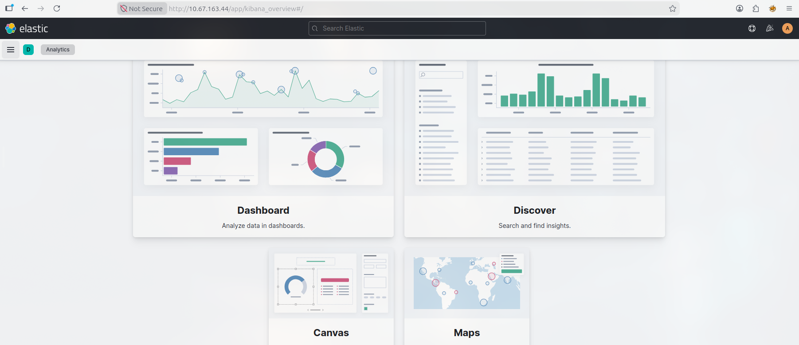
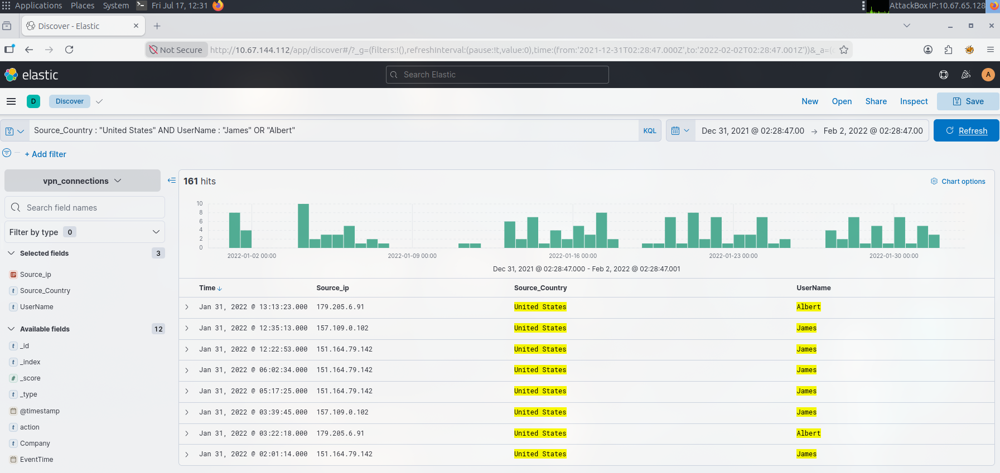
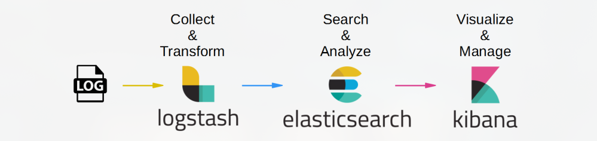

# Introduction to the Elastic Stack (ELK)

**Type:** 📘 Concept Documentation

## What is the Elastic Stack?

The Elastic Stack, commonly known as **ELK**, is a collection of open-source tools used to collect, process, store, search, and visualize large volumes of data. In cybersecurity, it is widely used as a SIEM platform for log analysis, threat detection, and incident investigation.

Originally, ELK stood for:

- **Elasticsearch**
- **Logstash**
- **Kibana**

Today, the Elastic Stack also includes **Beats** for lightweight data collection.



---

## Why is the Elastic Stack important?

The Elastic Stack enables organizations to centralize logs from multiple systems, search and analyze security events, create dashboards, and investigate potential attacks.

Common use cases include:

- Log management
- Security monitoring
- Threat hunting
- Incident response
- Infrastructure monitoring
- Compliance reporting

---

## Elastic Stack Components

### Elasticsearch

A distributed search and analytics engine.

- Stores indexed data
- Performs fast searches
- Supports large-scale environments

---

### Logstash

A data processing pipeline.

Responsibilities include:

- Collecting logs
- Parsing data
- Filtering events
- Forwarding data to Elasticsearch

---

### Kibana

The web interface for the Elastic Stack.

Analysts use Kibana to:

- Search logs
- Build dashboards
- Create visualizations
- Investigate alerts
- Monitor security events



---

### Beats

Lightweight agents installed on endpoints.

Common Beats include:

- Filebeat – Log collection
- Winlogbeat – Windows Event Logs
- Packetbeat – Network traffic
- Auditbeat – Linux audit logs
- Metricbeat – System metrics

---

## Data Flow

A typical Elastic Stack deployment follows this workflow:

```
Endpoints
      │
      ▼
    Beats
      │
      ▼
   Logstash
      │
      ▼
Elasticsearch
      │
      ▼
    Kibana
      │
      ▼
SOC Analyst
```



---

## Common Data Sources

The Elastic Stack can ingest data from:

- Windows Event Logs
- Linux Syslog
- Firewalls
- IDS/IPS
- EDR Solutions
- DNS Servers
- Web Servers
- Proxy Servers
- Active Directory
- Cloud Platforms
- Network Devices

---

## Common Analyst Workflow

1. Logs are collected by Beats.
2. Logstash processes and enriches the data.
3. Elasticsearch indexes the events.
4. Kibana displays dashboards and searchable logs.
5. The analyst investigates suspicious activity.
6. Alerts are escalated when necessary.

---

## Advantages

- Open source
- Highly scalable
- Powerful search capabilities
- Flexible dashboards
- Supports numerous integrations
- Strong visualization features

---

## Limitations

- Requires tuning and maintenance
- Initial setup can be complex
- Performance depends on proper indexing and resource allocation

---

## Common SOC Use Cases

- Failed login analysis
- Malware investigations
- PowerShell monitoring
- Threat hunting
- Network traffic analysis
- Dashboard monitoring
- Security alert investigations

---

## Elastic vs Splunk

| Elastic Stack               | Splunk                    |
|-----------------------------|---------------------------|
| Open-source core            | Commercial platform       |
| Elasticsearch search engine | Proprietary search engine |
| Kibana dashboards           | Splunk dashboards         |
| Highly customizable         | Easier initial deployment |
| Greater setup complexity    | Simpler user experience   |

---

## Related MITRE ATT&CK

The Elastic Stack can be used to detect activity across many ATT&CK tactics, including:

- TA0001 – Initial Access
- TA0002 – Execution
- TA0003 – Persistence
- TA0005 – Defense Evasion
- TA0006 – Credential Access
- TA0007 – Discovery
- TA0008 – Lateral Movement
- TA0011 – Command and Control
- TA0040 – Impact

---

## What I Learned

- The Elastic Stack is a powerful open-source platform for log management and security monitoring.
- Elasticsearch provides fast indexing and searching of large datasets.
- Kibana enables analysts to visualize and investigate security events.
- Beats and Logstash automate the collection and processing of telemetry.
- The Elastic Stack is widely used in SOC environments for threat detection and incident response.
