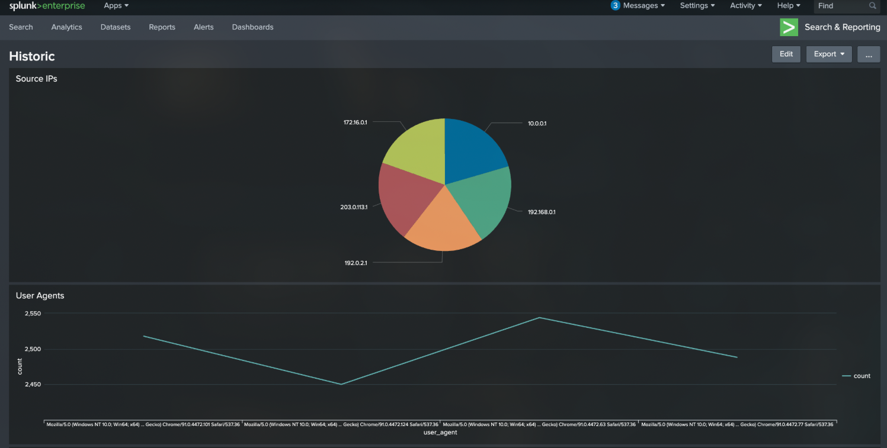
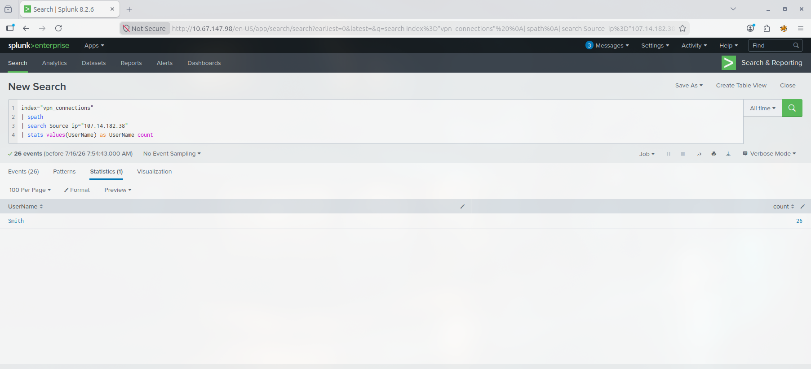
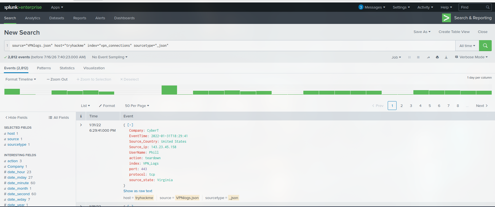

# Introduction to Splunk

**Type:** 📘 Concept Documentation

## What is Splunk?

Splunk is a Security Information and Event Management (SIEM) platform that collects, indexes, searches, and visualizes machine-generated data. It enables SOC analysts to investigate security events, detect threats, and monitor infrastructure through powerful search capabilities.



---

## Why is Splunk important?

Splunk helps analysts quickly search millions of log events, correlate data from multiple sources, and investigate security incidents.

Common use cases include:

- Investigating security alerts
- Detecting suspicious activity
- Monitoring infrastructure
- Threat hunting
- Incident response
- Compliance reporting

---

## Splunk Architecture

A basic Splunk deployment consists of:

### Forwarder

Collects logs from endpoints and sends them to Splunk.

### Indexer

Receives, indexes, and stores incoming data, making it searchable.

### Search Head

Provides the web interface where analysts search data, create dashboards, and investigate incidents.

---

## Common Data Sources

Splunk can ingest logs from:

- Windows Event Logs
- Linux Syslog
- Firewalls
- IDS/IPS
- EDR Solutions
- DNS Servers
- Web Servers
- Proxy Servers
- Active Directory
- Cloud Platforms
- Network Devices

---

## Important Splunk Concepts

### Events

Individual log records collected by Splunk.

### Index

A repository where Splunk stores searchable events.

### Source

The origin of the data (file, application, or device).

### Sourcetype

Defines the format of incoming data so Splunk can parse it correctly.

### Host

The system that generated the event.

---

## Search Processing Language (SPL)

Splunk uses the Search Processing Language (SPL) to query and analyze data.

Example:

```spl
index=windows EventCode=4625
```

Searches Windows failed logon events.

Another example:

```spl
index=windows EventCode=4688
| stats count by ProcessName
```

Counts process executions grouped by process name.



---

## Common Analyst Workflow

1. Receive an alert.
2. Open Splunk.
3. Search relevant logs.
4. Filter results.
5. Correlate related events.
6. Build a timeline.
7. Determine whether the activity is malicious.
8. Escalate or close the investigation.

---

## Typical Splunk Interface

A SOC analyst commonly works with:

- Search Bar
- Time Picker
- Search Results
- Fields Panel
- Statistics View
- Visualization Dashboard



---

## Advantages

- Fast log searching
- Powerful query language (SPL)
- Excellent dashboards and visualizations
- Scalable architecture
- Supports hundreds of data sources

---

## Limitations

- Commercial licensing can be expensive.
- Requires proper data onboarding and tuning.
- Large environments require significant infrastructure.

---

## Common SOC Use Cases

- Failed login investigations
- Malware execution analysis
- PowerShell monitoring
- Privilege escalation detection
- Lateral movement investigations
- Network anomaly detection

---

## Related MITRE ATT&CK

Splunk is commonly used to detect activity across many ATT&CK tactics, including:

- TA0001 – Initial Access
- TA0002 – Execution
- TA0003 – Persistence
- TA0005 – Defense Evasion
- TA0006 – Credential Access
- TA0007 – Discovery
- TA0008 – Lateral Movement
- TA0011 – Command and Control
- TA0040 – Impact

---

## What I Learned

- Splunk enables centralized log analysis from multiple data sources.
- SPL allows analysts to efficiently search and filter security events.
- Correlating events from different systems provides valuable investigation context.
- Effective investigations rely on understanding event fields, timestamps, and data sources.
- Splunk is one of the primary tools used by SOC analysts for threat detection and incident response.
