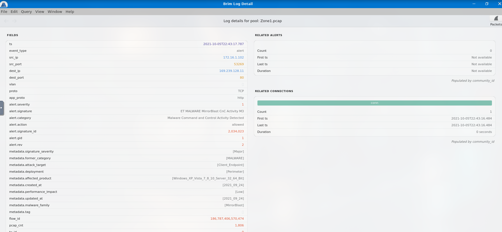
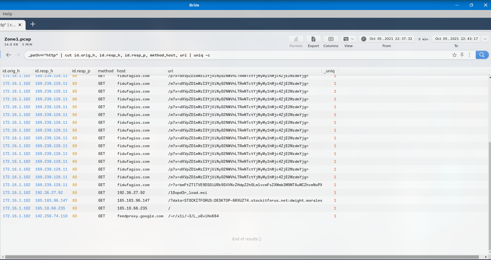
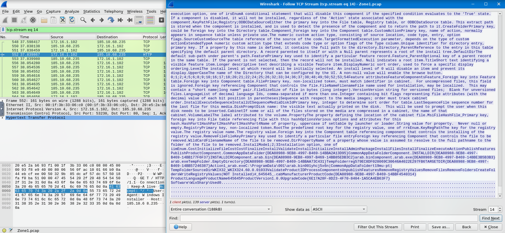

Q# Warzone 1 — IDS Alert Triage using Brim & Wireshark

**Type:** 🧪 Investigation Write-up

## Objective

Investigate an IDS/IPS alert to determine whether it represents a true positive by analyzing network traffic, extracting Indicators of Compromise (IOCs), enriching the findings with threat intelligence, and reconstructing the attack sequence.

---

## Scenario

An IDS generated a high-severity alert indicating possible malware Command-and-Control (C2) activity originating from an internal host. The investigation was performed using **Brim** for Zeek log analysis and **Wireshark** for packet-level inspection.

---

## Tools Used

* **Brim** — Zeek log analysis and alert triage
* **Wireshark** — Packet inspection and TCP stream reconstruction
* **VirusTotal** — IOC enrichment and threat intelligence

---

## Initial Alert Review

The alert details were examined in Brim.

### Key Findings

| Field           | Value                                         |
| --------------- | --------------------------------------------- |
| Alert Signature | ET MALWARE MirrorBlast CnC Activity M3        |
| Severity        | Major                                         |
| Category        | Malware Command and Control Activity Detected |
| Source IP       | 172.16.1.102                                  |
| Destination IP  | 169.239.128.11                                |
| Protocol        | HTTP                                          |

The alert indicated that the internal host **172.16.1.102** initiated HTTP communication with the external address **169.239.128.11**, which was flagged by Emerging Threats signatures as **MirrorBlast Command-and-Control activity**.

---

## Threat Intelligence Enrichment

The destination infrastructure was investigated using VirusTotal.

### Enrichment Results

| Artifact                | Result      |
| ----------------------- | ----------- |
| Malware Family          | MirrorBlast |
| Associated Threat Group | TA505       |

The enrichment confirmed that the destination infrastructure had prior associations with the **MirrorBlast malware family** and the **TA505** threat group, significantly increasing confidence that the IDS alert was a **true positive** rather than a false positive.

---

## HTTP Traffic Analysis

Brim was used to analyze HTTP requests generated by the compromised host.

**Query used**

_path=="http"
| cut id.orig_h, id.resp_h, id.resp_p, method, host, uri
| uniq -c

### Observations

* Multiple **HTTP GET** requests were issued by **172.16.1.102**.
* Communication occurred with several external hosts, including **fidufagios.com** and additional suspicious IP addresses.
* The traffic pattern was consistent with malware staging and payload retrieval.

The HTTP analysis revealed repeated requests to the same external infrastructure, suggesting automated malware communication rather than normal user browsing activity.

---

## Additional Malicious Infrastructure

Further pivoting identified additional external IP addresses involved in the attack:

* **185.183.96.147**
* **192.36.27.92**

The presence of multiple external hosts indicates that the malware did not rely on a single C2 server and instead used additional infrastructure for payload delivery and communication.

---

## User-Agent Analysis

Inspection of the HTTP requests revealed the following User-Agent string:

REBOL View 2.7.8.3.1

This User-Agent is uncommon in modern enterprise environments and can serve as a useful network-based indicator when hunting for similar activity across proxy, firewall, or Zeek logs.

---

## Downloaded Payloads

Analysis of the HTTP traffic identified two downloaded MSI installer files:

* **filter.msi**
* **10opd3r_load.msi**

These files were retrieved from the suspicious external infrastructure and are consistent with **payload staging** during a malware infection.

---

## Packet-Level Verification

Wireshark was used to inspect the TCP stream associated with the suspicious download activity.

Following the TCP stream confirmed the transfer of installer data from the remote host to the compromised endpoint, providing packet-level validation of the payload download observed in Brim.

---

## Recovered File Artifacts

The TCP stream analysis revealed the destination paths used by the malware:

* **C:\ProgramData\001\arab.bin**
* **C:\ProgramData\001\arab.exe**
* **C:\ProgramData\Local\Google\rebol-view-278-3-1.exe**
* **C:\ProgramData\Local\Google\example.rb**

These artifacts provide valuable endpoint IOCs for host-based detection and forensic validation.

---

## Indicators of Compromise (IOCs)

| Type                       | Value                                                  |
| -------------------------- | ------------------------------------------------------ |
| Source IP                  | 172.16.1.102                                           |
| Primary Destination IP     | 169.239.128.11                                         |
| Additional Destination IPs | 185.183.96.147, 192.36.27.92                           |
| Malware Family             | MirrorBlast                                            |
| Threat Group               | TA505                                                  |
| User-Agent                 | REBOL View 2.7.8.3.1                                   |
| Downloaded Files           | filter.msi, 10opd3r_load.msi                           |
| File Artifacts             | arab.bin, arab.exe, rebol-view-278-3-1.exe, example.rb |

---

## Attack Timeline

1. IDS generated **ET MALWARE MirrorBlast CnC Activity M3**.
2. Internal host **172.16.1.102** initiated HTTP communication with **169.239.128.11**.
3. Brim analysis identified repeated HTTP GET requests to suspicious infrastructure.
4. Additional malicious IP addresses (**185.183.96.147** and **192.36.27.92**) were discovered.
5. MSI payloads (**filter.msi** and **10opd3r_load.msi**) were downloaded.
6. Wireshark TCP stream analysis confirmed the transfer of installer data.
7. Endpoint file artifacts were recovered from the reconstructed traffic.
8. VirusTotal enrichment linked the activity to **MirrorBlast / TA505**.
9. The alert was determined to be a **True Positive**.

---

## MITRE ATT&CK Mapping

| Tactic              | Technique                                             |
| ------------------- | ----------------------------------------------------- |
| Command and Control | T1071.001 — Application Layer Protocol: Web Protocols |
| Command and Control | T1105 — Ingress Tool Transfer                         |
| Discovery           | T1049 — System Network Connections Discovery          |

---

## Verdict

**True Positive**

The investigation confirmed that the host **172.16.1.102** communicated with known malicious infrastructure associated with the **MirrorBlast** malware family and **TA505**. Network analysis identified repeated C2 communication, payload downloads, and recovered file artifacts, while Wireshark provided packet-level confirmation of the malicious transfers.

---

## Lessons Learned

* IDS alerts should be validated through **manual network investigation** rather than relying solely on signature output.
* **Brim** enables rapid triage of Zeek logs and efficient IOC discovery.
* **Wireshark** complements log analysis by providing packet-level validation and artifact recovery.
* Threat intelligence enrichment adds critical context for **attribution and confidence assessment**.
* Combining alert metadata, HTTP analysis, packet inspection, and IOC enrichment provides a defensible basis for determining whether an alert is a **true positive**.
